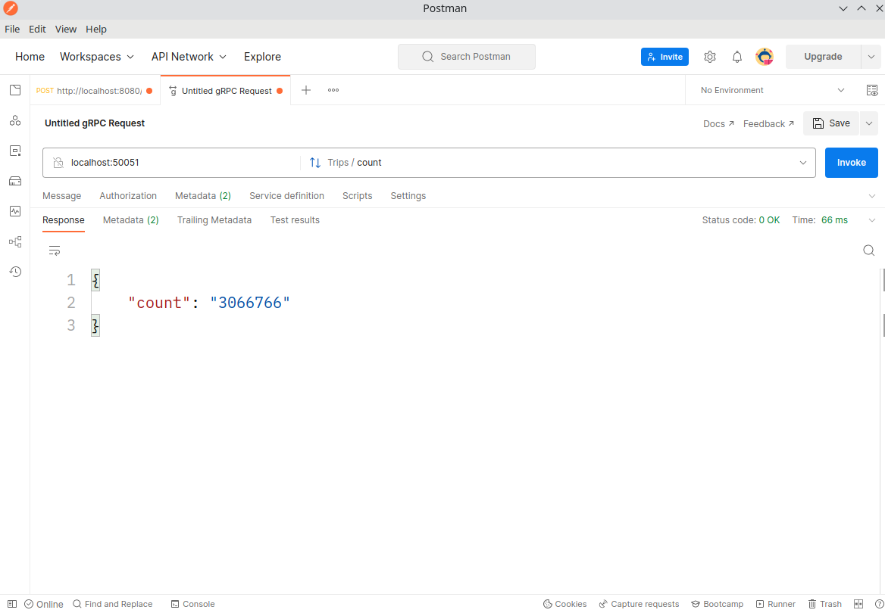

# Querying Data using gRPC APIs


In the previous steps, you already connected with data sources. Now let's learn how to query the data using gRPC APIs. We will use  `dozer.common.CommonGrpcService` in the next sessions, in making a query in Dozer. This service takes query parameters, described in details in next session. 


> *__NOTE__: this format of query requires the module grpcurl. You can install it  from its version in [grpcurl repository](https://github.com/fullstorydev/grpcurl).*


---

## Parameters


| Parameter | Description |
| -------- | -------- |
| **count**     | Counts the number of entries in the endpoint.     |
| **query**   | Defines specific content or actions, based on the data being passed.    |


---


## count Parameter

### Description

The *count* parameter of the Common Query Format counts the number of entries that match the specified endpoint. The count parameter can be useful when specifying data collections or for getting statistical information. 

### Behavior

* It appends at the end of the `dozer.common.CommonGrpcService` .
* Returns the result in the JSON format, like this:
```json
{
  "count": " "
}
```


**Example: count in Common Query Format**

In our dataset, one of the endpoints we have is called `trips_cache`. Let's count all the number of entries in this endpoint. The query has the parameters:
* the endpoint, for example `trips_cache`, 
* the gRPC service, which is `dozer.common.CommonGrpcService/count`

In the terminal, write the command:

```bash
grpcurl -d '{"endpoint": "trips_cache"}' \
    -plaintext localhost:50051 dozer.common.CommonGrpcService/count
```
    
you will get the number of entries, which in this case is 3782. 
    
    
```json
{
  "count": "3782"
}
```


---

## query Parameter

### Description
The *query* parameter is defined by a set of body parameters attached to the gRPC call. Each of the components of the query is a body parameter, that help define specific content or actions based on the data being passed.

### Behavior

* It appends at the end of the `dozer.common.CommonGrpcService` .
* Returns the response in the JSON format, like this:
```json
{
  "fields": [
    {
      "typ": " ",
      "name": " ",
      "nullable": "true/false"
    }
  ],
  "records": [
    {
      "id": " ",
      "record": {
        "values":
        "version":
      }
    }
  ]
}
```

### Parameters

`$limit` *integer*  *Optional*
The number limit specifies the number of resources that a single response contains.
  
`$filter` *string*  *Optional*
Field and value to filter items in a resource collection to return a subset of resources in the response.

`$order_by` *string*  *Optional*
Field by which will be ordered the result in the response.


**Example: query in Common Query Format**

In this example, let's get the fields and a record in the endpoint `trips_cache`. We will format the query according the Common Query Format. The parameters in this query are:

* the endpoint, in this example `trips_cache`, 
* the `query` , in this example `{\"$limit\":1}` because we want to show only one record,
* the gRPC service is `dozer.common.CommonGrpcService/count`


To run this query, write in the terminal this command: 

```bash
grpcurl -d '{"endpoint": "trips_cache", "query": "{\"$limit\":1}"}' \
    -plaintext localhost:50051 dozer.common.CommonGrpcService/query
```

It will be displayed a single entry, which is similar to this example. Note, there are displayed the fields and one record.

    
```json
{
  "fields": [
    {
      "typ": "Int",
      "name": "pickup_location",
      "nullable": true
    },
    {
      "typ": "Int",
      "name": "dropoff_location",
      "nullable": true
    },
    {
      "typ": "Int",
      "name": "total_trips"
    },
    {
      "typ": "Int",
      "name": "min_trip_time",
      "nullable": true
    },
    {
      "typ": "Int",
      "name": "max_trip_time",
      "nullable": true
    }
  ],
  "records": [
    {
      "id": "3597",
      "record": {
        "values": [
          {
            "intValue": "43"
          },
          {
            "intValue": "230"
          },
          {
            "intValue": "1045"
          },
          {
            "intValue": "122"
          },
          {
            "intValue": "2713"
          }
        ],
        "version": 45
      }
    }
  ]
}
```

**Example: query with filter in Common Query Format**

In this example, let's add a filter, by choosing a location of the trip. Again, we choose to show only one record.

* the endpoint, in this example `trips_cache`, 
* the `query` , in this example `{\"$limit\":1}` because we want to show only one record,
* the `filter` , which is `{\"pickup_location\": 211}` because we want to display one of the trips that has pickup location equals to 211,
* the gRPC service is `dozer.common.CommonGrpcService/count`


To run this query, write in the terminal the command: 

```bash
grpcurl -d '{"endpoint": "trips_cache", "query": "{\"$limit\":1, \"$filter\": {\"pickup_location\": 211}}"}' \
    -plaintext localhost:50051 dozer.common.CommonGrpcService/query
```


It will be displayed a single entry, which is similar to this one:

    
```json
{
  "fields": [
    {
      "typ": "Int",
      "name": "pickup_location",
      "nullable": true
    },
    {
      "typ": "Int",
      "name": "dropoff_location",
      "nullable": true
    },
    {
      "typ": "Int",
      "name": "total_trips"
    },
    {
      "typ": "Int",
      "name": "min_trip_time",
      "nullable": true
    },
    {
      "typ": "Int",
      "name": "max_trip_time",
      "nullable": true
    }
  ],
  "records": [
    {
      "id": "3365",
      "record": {
        "values": [
          {
            "intValue": "211"
          },
          {
            "intValue": "132"
          },
          {
            "intValue": "1112"
          },
          {
            "intValue": "1453"
          },
          {
            "intValue": "13830"
          }
        ],
        "version": 112
      }
    }
  ]
}
```


---


## Use Postman to test gRPC queries.

Postman is a scalable API testing tool, which you can use to view gRPC APIs with full reflection support. 
In Postman, create a new gRPC request. Enter the host and the port of your API, similar to this example.




