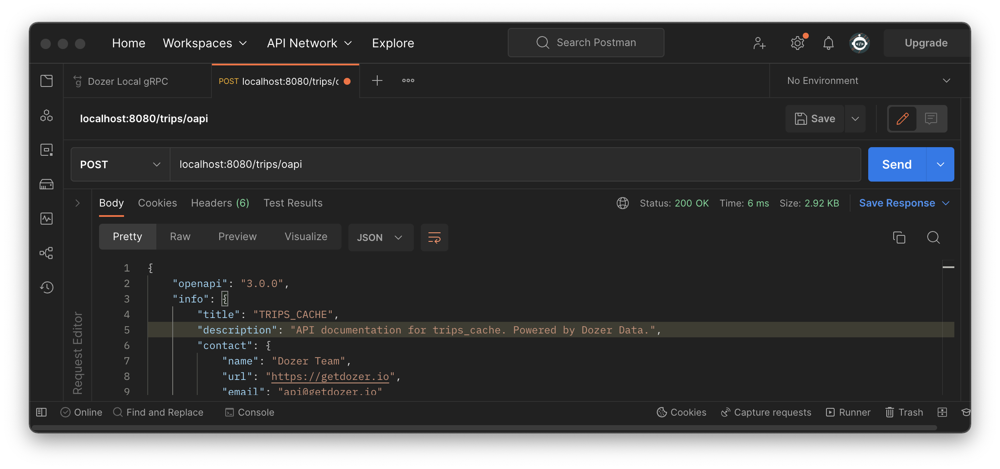

# Querying Data using REST APIs

Dozer automatically produces REST APIs including the documentation support. To make the query, let's use `curl`. The format of the request is:

```bash
curl -X POST  URL \
  --header 'Content-Type: application/json' \
  --data-raw QueryParameters
```

---

## Parameters

| Parameter | Description |
| -------- | -------- |
| **count**     | Counts the number of entries in the endpoint.     |
| **query**   | Defines a specific content or action, based on parameters passed in the Post Request.    |
| **oapi**   | Generates Open API3 documentation.   |


---

## count Parameter

### Description

The *count* parameter of counts the number of entries that match the specified endpoint. The count parameter can be useful when specifying data collections or for getting statistical information. 

### Behavior

* It appends at the end of the URL, in the format `URL/count`
* Returns the response in the JSON format :
```json
[
  {"count": " "},
]  
```

---

## query Parameter

### Description
The *query* parameter is defined by a set of body parameters attached to the URL in the cURL call. Each of the components of the query, is a body parameter, that helps define specific content or actions based on the data being passed.

### Behavior

* It appends at the end of the URL, in the format
 `curl -X POST  http://localhost:8080/endpoint/query` .
* Returns the result with the fields and the values that fulfill the query. The result is a JSON, similar to:
```json
[
  {"field":"value"},
]
```

### Parameters

`$limit` *integer*  *Optional*
The number limit specifies the number of resources that a single response contains.
  
`$filter` *string*  *Optional*
Field and value to filter items in a resource collection to return a subset of resources in a response.

`$order_by` *string*  *Optional*
Field by which will be ordered the result in the response.


**Example: display only 3 entries, using REST APIs**

In this example, let's show only 3 entries, by making a curl command. It has the parameters:

* the POST request,
* the URL of the REST API
* the header format
* and the data-row, in this example we limit it to 3 rows.


In the terminal, you can try to give this command:

```bash
curl -X POST  http://localhost:8080/trips/query \
  --header 'Content-Type: application/json' \
  --data-raw '{"$limit":3}'
```

The result is some data similar to this one:

```json
[{"pickup_location":43,"dropoff_location":230,"total_trips":1045,"min_trip_time":122,"max_trip_time":2713,"__dozer_record_id":3597,"__dozer_record_version":45},
{"pickup_location":161,"dropoff_location":1,"total_trips":1091,"min_trip_time":1437,"max_trip_time":11061,"__dozer_record_id":3369,"__dozer_record_version":91},
{"pickup_location":143,"dropoff_location":132,"total_trips":1022,"min_trip_time":1641,"max_trip_time":7694,"__dozer_record_id":3711,"__dozer_record_version":22}]
```


**Example: query with filter, using REST APIs**

Now let's add a filter, choosing a min_trip_time equals 150. The parameters in this example are:

* the POST request,
* the URL of the REST API
* the header format
* and the data-row, in this example we limit it to 3 rows and add filter `"min_trip_time": 150`.

In the terminal, write the command:

```bash
curl -X POST  http://localhost:8080/trips/query \
  --header 'Content-Type: application/json' \
  --data-raw '{"$filter": {"min_trip_time": 150}, "$limit":3}'
```
  
 The result displayed are three records, similar to these:
 
 ```json
[{"pickup_location":211,"dropoff_location":113,"total_trips":2247,"min_trip_time":150,"max_trip_time":5187,"__dozer_record_id":1715,"__dozer_record_version":1247},
{"pickup_location":179,"dropoff_location":146,"total_trips":1306,"min_trip_time":150,"max_trip_time":3160,"__dozer_record_id":2934,"__dozer_record_version":306},
{"pickup_location":135,"dropoff_location":95,"total_trips":3442,"min_trip_time":150,"max_trip_time":5706,"__dozer_record_id":676,"__dozer_record_version":2442}]
 ```


---

## oapi Parameter

### Description
The *oapi* parameter shows the API Documentation, and Dozer provides it by making a Post request in cURL.

### Behavior

* It appends at the end of the URL, in the format:

 `curl -X POST  http://localhost:8080/trips/oapi`.
* Returns the API Documentation. 


The response will be the full documentation that Dozer generates and which might help in showing all the endpoints and parameters of the REST API.

 
## Test API using Postman

Alternatively, you can import all the above curl requests to Postman.



