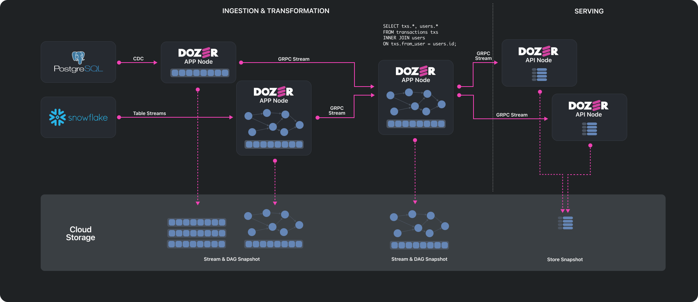
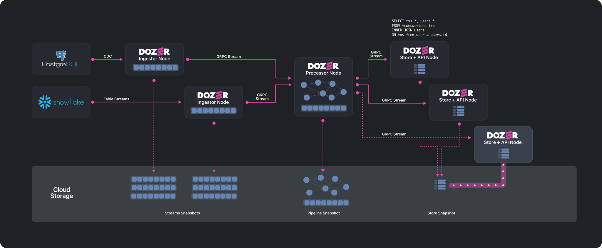

# Architecture

Dozer's architecture is built around two main types of nodes: App Nodes and API Nodes. These nodes work together to facilitate data ingestion, processing, and exposure through APIs.

## Deployment Considerations

In a production environment, App Nodes and API Nodes are deployed as separate, independent Docker images. This allows for greater scalability and management flexibility. However, for ease of development and testing, these nodes can be run as separate threads within a single process.

## Node Types

### App Nodes

App Nodes in Dozer are responsible for data ingestion and real-time processing. They capture data from various data sources like databases, data warehouses, and object storages using methods like Change Data Capture (CDC) or polling. Post-ingestion, data is processed using an in-built streaming SQL engine.

The architecture allows for flexibility in deployment. An App Node can be configured solely for data capture or for downstream processing. App Nodes can also be chained, enabling complex, multi-stage data processing pipelines.

### API Nodes

API Nodes act as the data access layer in the Dozer architecture. They receive processed data from App Nodes and implement a low-latency data store using LMDB (Lightning Memory-Mapped Database). This data is then exposed through gRPC and REST APIs, with auto-generated API definitions accessible via OpenAPI or Protocol Buffers.

## Data Flows

### App Nodes

App Nodes in Dozer serve a dual role, encapsulating both the functionality of Ingestor Nodes and Processor Nodes. They are responsible for data ingestion, real-time transformation, and data flow management. The design allows users to configure an App Node either for pure data ingestion, downstream processing, or both. These nodes can also be chained for more complex, multi-stage data processing pipelines. Below is a more detailed breakdown of these functionalities within an App Node:

#### Data Ingestion and Queue Management

App Nodes connect to various data sources and stream data into the system, maintaining an in-memory queue for incoming messages. To prevent memory overflow, this queue has a size limit. When the incoming data reaches a threshold, the App Node offloads the earliest messages in the queue to cloud storage, freeing up memory for new data. 

#### Data Access and Distribution

Just like traditional Ingestor Nodes, App Nodes expose a gRPC endpoint for downstream data access. This protocol serves as a critical data access point and allows for the distribution and dissemination of data throughout the system.

#### Real-time Transformation and Data Flow

App Nodes also embody the functionalities of Processor Nodes, translating SQL queries into a Direct Acyclic Graph (DAG) for real-time transformation execution. They maintain a similar queue system as the ingestion component, balancing in-memory and cloud storage for optimal performance. 

#### State Management

For data processing, a state is kept in memory and periodically snapshotted to cloud storage for data integrity. This snapshotting process employs a variant of the Lamport-Candy algorithm to ensure data consistency.

#### Micro-node Architecture

Within each App Node, multiple micro-nodes execute individual operations like joins, filtering, and aggregations. These micro-nodes run in their own threads, allowing for efficient multi-core processing.

#### Initialization Steps

When an App Node is initialized, it undergoes several key steps:

1. **DAG Transformation**: SQL queries are translated into a Direct Acyclic Graph, setting the stage for organized data processing.
   
2. **Upstream Connection**: Connections to necessary upstream nodes are established, forming the primary data pathway.
   
3. **Data Retrieval**: The node accesses both offloaded and in-memory data from upstream nodes, combining them for processing.

4. **Data Processing**: The consolidated data set is processed, generating a new data stream that is managed through in-memory and cloud storage.

App Nodes are a flexible and robust solution for complex real-time data ingestion and processing requirements.

### API Nodes

The API nodes are the backbone of Dozer's data accessibility and storage mechanism. They connect to upstream nodes, be they Ingestion or Processor nodes, in a similar manner as previously described for Processor nodes. 

Upon establishing this connection, the API nodes receive a flow of data which they then store using an embedded LMDB (Lightning Memory-Mapped Database) system. LMDB has been selected for its memory-efficient and high-performance attributes which align perfectly with Dozer's ethos of efficient and effective data management.

To facilitate rapid and efficient data access, all stored data in the API nodes is automatically indexed. This streamlined indexing process drastically improves data retrieval times, which is especially beneficial when dealing with vast volumes of data.

Beyond data storage and retrieval, API nodes also expose APIs in both gRPC and REST formats. This dual-API exposure creates an accessible and flexible interface for data querying and manipulation by users or other downstream systems.

The querying capabilities of the API nodes extend beyond simple primary key lookup, supporting secondary key lookups, full-text search, filtering, and pagination.

Lastly, to ensure durability and data safety, the LMDB database used by the Store/API nodes is periodically snapshotted to cloud storage. To bolster scalability and elasticity, the architecture of Dozer allows for the dynamic scaling of Store/API nodes, much like stateless API servers in a microservice-oriented architecture. 

When a new Store/API node is initiated, it commences its operation cycle with a "hydration" phase. In this phase, it is populated with the most recent snapshot of the data from cloud storage. This snapshot serves as a baseline data set for the new node to start operating.

Following the hydration phase, the new API node catches up to the current data stream by connecting to its upstream node, which could be either a Processor or Ingestor node. The upstream node starts streaming the in-memory data to the newly initiated node, effectively bringing it up to speed with the latest data changes.

This dynamic scaling functionality offers a significant advantage when dealing with fluctuating workloads or when swift system expansion is required. It ensures that the Dozer system can adapt to the demands of the data environment, providing consistent performance even under changing conditions.