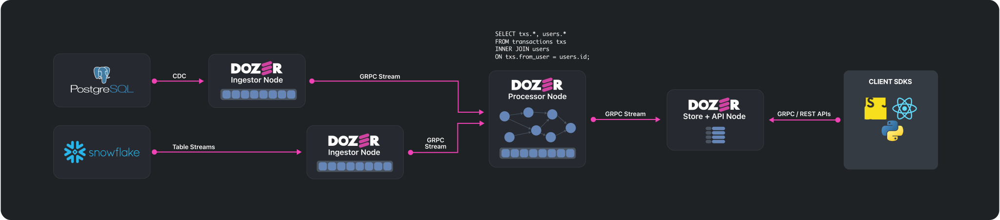

# Architecture

The architectural design of Dozer utilizes three distinct types of nodes: Ingestor, Processor, and Store/API. These nodes work in harmony, communicating with each other through gRPC to perform their respective functions seamlessly. In a typical production deployment, each of these nodes operates as an independent Docker image, making it easy to scale, manage, and deploy.

However, for development purposes and ease of use, it's possible to run multiple types of nodes as separate threads within the same process. This flexibility in its architectural design further enhances Dozer's adaptability, making it a robust and reliable solution for building and maintaining real-time data applications. 

## Node Types
Dozer's architecture is designed to efficiently process and deliver data through three types of nodes: Ingestor nodes, Processor nodes, and Store/API nodes. 

**Ingestor Nodes**: These nodes are responsible for data ingestion from various sources such as databases, data warehouses, or object storages. They capture data continuously in real-time using Change Data Capture (CDC) or near-real-time using polling mechanisms. The captured data is transformed into Dozer operations (Inserts, Updates, Deletes) and ingested into the system.

**Processor Nodes**: These nodes embody a streaming SQL engine that enables real-time data transformations. As data is ingested, these transformations operate on the incoming streams directly. Processor nodes can source data from multiple ingestors or other processors, and they can combine and aggregate data using SQL.

**Store/API Nodes**: Once data is processed, it's transferred to the Store nodes. These nodes implement a data store using LMDB (Lightning Memory-Mapped Database), an ultra-fast, ultra-compact key-value embedded data store. The stored data is automatically indexed to expedite lookup performance and is accessible through gRPC and REST APIs. The definitions of the exposed data are available through OpenAPI or Protocol Buffers definitions.

## Data Flows

### Ingestor Nodes
Ingestor nodes form the initial data pipeline by connecting to various data sources and streaming data into the system. Each Ingestor node maintains an in-memory queue of all incoming messages, allowing for high-speed data processing. However, this queue has a size limit to prevent memory overflow. 

When the volume of incoming data reaches a certain threshold, the Ingestor node initiates an offloading process. The earliest (or head) messages in the queue, which are likely to have been processed already, are moved to a cloud storage system. This mechanism of transferring older data to more permanent storage allows the Ingestor node to free up memory space for new incoming data, ensuring smooth, uninterrupted data flow and real-time processing.

Ingestor nodes not only process incoming data but also serve as crucial data access points for the rest of the system. They achieve this by exposing a gRPC endpoint that downstream nodes can connect to. This gRPC endpoint implements a protocol to provide access to data for all downstream nodes, effectively allowing for the distribution and dissemination of data across the system.

### Processor Nodes
Processor nodes in Dozer play a vital role in executing transformations and managing data flow. They translate any SQL query into a streaming Direct Acyclic Graph (DAG), enabling real-time transformation execution. To access the data, these Processor nodes form a gRPC streaming connection with upstream nodes, which could be either Ingestor nodes or other Processor nodes. Like their Ingestor counterparts, Processor nodes also expose a gRPC endpoint to facilitate data access for downstream nodes.

To manage the data generated by transformations, Processor nodes maintain a queue system similar to the one employed by Ingestor nodes. A portion of this data queue is kept in memory, while the remainder is offloaded to cloud storage as needed to maintain optimal memory usage.

In addition to data queue management, Processor nodes maintain a state for data processing. This state is preserved in memory and snapshotted to cloud storage at regular intervals to ensure data integrity. The snapshotting process utilizes a variation of the Lamport-Candy algorithm to ensure consistency.

Each Processor node hosts numerous micro-nodes, each responsible for executing individual operations. For instance, if a query involves joining several data sources, filtering, and aggregations, each operation is assigned to an individual micro-node. These micro-nodes each run in their own thread, with data passed from one micro-node to the next in a pipeline fashion. This approach maximizes efficiency when running on multi-core processors, ensuring fast and reliable data processing.

When a new Processor node is instantiated in Dozer, several key steps occur to initialize it and prepare it for operation:

1. **DAG Transformation**: The incoming SQL is converted into a Direct Acyclic Graph (DAG), and all micro-nodes are initialized for operation. This process sets the stage for efficient and organized data processing.

2. **Connection to Upstream Nodes**: The Processor node establishes connections with all necessary upstream nodes and requests access to the ingested data. This connection forms the primary data pathway for the Processor node.

3. **Data Access from Upstream Nodes**: In response to the request from the Processor node, the upstream nodes provide both the location of offloaded data stored in cloud storage, as well as streaming their in-memory data to the downstream node. This process ensures the Processor node receives all necessary data for processing.

4. **Data Processing**: Upon receiving the data, the Processor node combines the offloaded data with the live data it receives. It starts processing this consolidated data set, generating a new data stream. This newly created data stream is partially kept in memory and partially offloaded to cloud storage, maintaining a balance for efficient resource usage.

### Store/API Nodes

The Store/API nodes are the backbone of Dozer's data accessibility and storage mechanism. They connect to upstream nodes, be they Ingestion or Processor nodes, in a similar manner as previously described for Processor nodes. 

Upon establishing this connection, the Store/API nodes receive a flow of data which they then store using an embedded LMDB (Lightning Memory-Mapped Database) system. LMDB has been selected for its memory-efficient and high-performance attributes which align perfectly with Dozer's ethos of efficient and effective data management.

To facilitate rapid and efficient data access, all stored data in the Store/API nodes is automatically indexed. This streamlined indexing process drastically improves data retrieval times, which is especially beneficial when dealing with vast volumes of data.

Beyond data storage and retrieval, Store/API nodes also expose APIs in both gRPC and REST formats. This dual-API exposure creates an accessible and flexible interface for data querying and manipulation by users or other downstream systems.

The querying capabilities of the Store/API nodes extend beyond simple primary key lookup, supporting secondary key lookups, full-text search, filtering, and pagination.

Lastly, to ensure durability and data safety, the LMDB database used by the Store/API nodes is periodically snapshotted to cloud storage. To bolster scalability and elasticity, the architecture of Dozer allows for the dynamic scaling of Store/API nodes, much like stateless API servers in a microservice-oriented architecture. 

When a new Store/API node is initiated, it commences its operation cycle with a "hydration" phase. In this phase, it is populated with the most recent snapshot of the data from cloud storage. This snapshot serves as a baseline data set for the new node to start operating.

Following the hydration phase, the new Store/API node catches up to the current data stream by connecting to its upstream node, which could be either a Processor or Ingestor node. The upstream node starts streaming the in-memory data to the newly initiated node, effectively bringing it up to speed with the latest data changes.

This dynamic scaling functionality offers a significant advantage when dealing with fluctuating workloads or when swift system expansion is required. It ensures that the Dozer system can adapt to the demands of the data environment, providing consistent performance even under changing conditions.