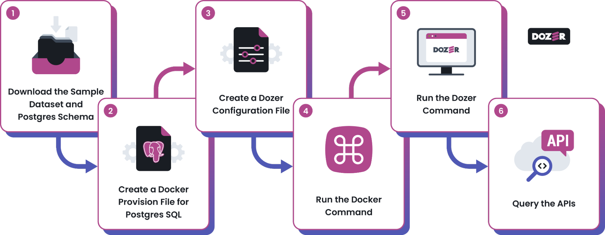
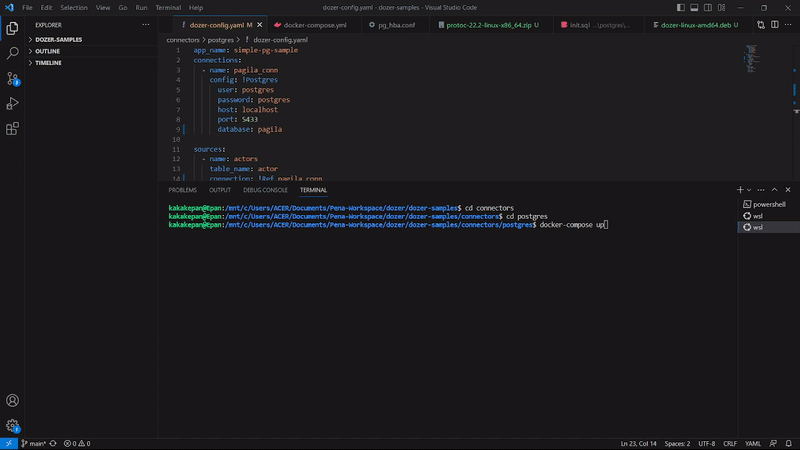
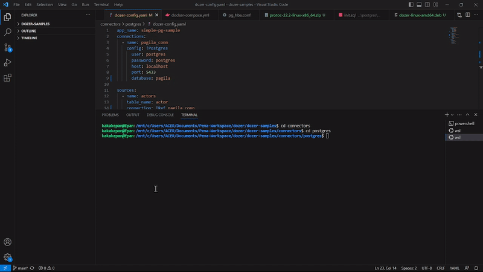

# Connecting to Postgres 
Dozer's Postgres connector integration is a robust feature that seamlessly connects with Postgres databases using Change Data Capture (CDC) technology.

# How to Connect Postgres with Dozer

## Prerequisites

Before connecting Postgres with Dozer, ensure you have already done the following:

- Postgres version 10 or the most recent version.
- Logical Write-Ahead Log (WAL) Replication is enabled.
- At least one replication slot is available on your Postgres database.
- The Postgres database user must have replication permissions, specifically the "userepl" permission.
- [Install Dozer](https://getdozer.io/docs/installation).
- [Install Docker](https://www.docker.com/).
- Postgres Account Information for the authentication and database access:

  | Field              | Description                                                                                             | Parameters   |
  |--------------------|---------------------------------------------------------------------------------------------------------|--------------|
  | Postgres Username  | The unique identifier of a user account within the PostgreSQL database system.                         | `PG_USER`    |
  | Postgres Password  | A confidential string of characters associated with the Postgres username for security purposes.       | `PG_PASSWORD`  |
  | Postgres Database  | A collection of related data and schema objects within the PostgreSQL database management system.       | `PG_DB`        |

  If you do not wish to setup your own postgres instance, we have created a sample acoount that can be used for testing. Here are the connection parameters:

  | Parameter             | Value     |
  |-----------------------|-----------|
  | `POSTGRES_DB`           | `pagila`    |
  | `POSTGRES_USER`         | `postgres`  |
  | `POSTGRES_PASSWORD`     | `postgres`  |


## Integrate Postgres with Dozer



### Step 1: Download the Sample Dataset and Postgres Schema

Before downloading the sample dataset:

1. Create **a new empty file project** to store all the required files for the Postgres connectors.
2. Download the **sample dataset and Postgres schema** for Pagila by running the following code:

```bash
mkdir -p data

curl https://raw.githubusercontent.com/devrimgunduz/pagila/726c724df9f86406577c47790d6f8e6f2be06186/pagila-data.sql --output ./data/pagila-data.sql
curl https://raw.githubusercontent.com/devrimgunduz/pagila/726c724df9f86406577c47790d6f8e6f2be06186/pagila-schema.sql --output ./data/pagila-schema.sql

cat ./data/pagila-schema.sql > ./data/init.sql
cat ./data/pagila-data.sql >> ./data/init.sql

```

### Step 2: Create a Docker Provision File for Postgres SQL

To create a docker provision file, follow the steps below:

1. On your Project folder, create a new file named ` **docker-compose.yml** `.
2. Paste the following code on your **docker provision** file:

```yaml
version: '3.8'
services:
  postgres:
    container_name: dozer-pagila-postgres
    image: debezium/postgres:13
    volumes:
      - ./pg_hba.conf:/var/lib/foo/pg_hba.conf
      - ./data/init.sql:/docker-entrypoint-initdb.d/init.sql
    command: postgres -c hba_file=/var/lib/foo/pg_hba.conf
    environment:
      POSTGRES_DB: pagila
      POSTGRES_USER: postgres
      POSTGRES_PASSWORD: postgres
      ALLOW_IP_RANGE: 0.0.0.0/0
    ports:
      - '5433:5432'
    healthcheck:
      test: [ "CMD-SHELL", "pg_isready -U postgres -d pagila" ]
      interval: 5s
      timeout: 5s
      retries: 5

```

### Step 3: Create a Dozer Configuration File

To create a dozer configuration file, follow the steps below:

1. On your Project folder, create a new file named ` **dozer-config.yaml** `.
2. Paste the following code on your **dozer configuration** file:

```yaml
app_name: simple-pg-sample
connections:
  - name: pagila_conn
    config: !Postgres
      user: postgres
      password: postgres
      host: localhost
      port: 5433
      database: pagila

sources:
  - name: actors
    table_name: actor
    connection: !Ref pagila_conn
    columns:
      - actor_id
      - first_name
  - name: films
    table_name: film
    connection: !Ref pagila_conn
    columns:
      - film_id
      - title

endpoints:
  - name: actors
    path: /actors
    table_name: actors

  - name: films
    path: /films
    table_name: films

```

### Step 4: Run the Docker Command

After everything has been set up within your Postgres project folder, run the docker command below:

```bash
docker-compose up
```

This will automatically process and store the processed data in the cache. The data is prepared and available for access.



### Step 5: Run the Dozer Command

Run the sample database that has been processed by running the following command:

```bash
dozer
```

This will make the data accessible via REST or gRPC server.



### Step 6: Query the APIs

You can query the APIs using Postman's REST (HTTP) method or the gRPC method.

