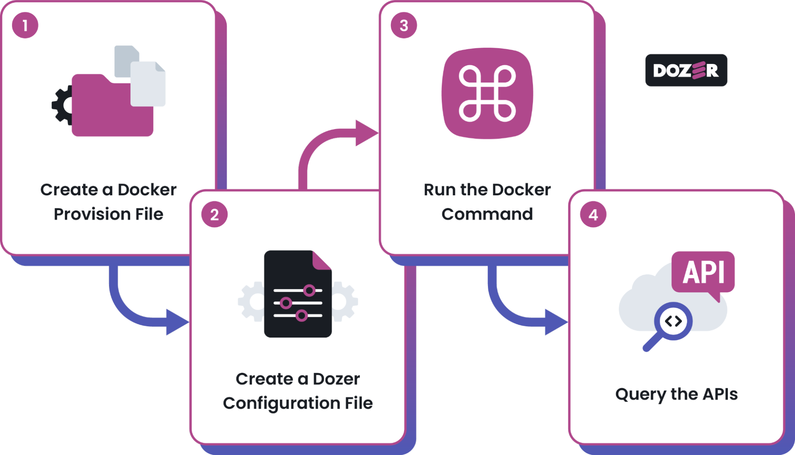
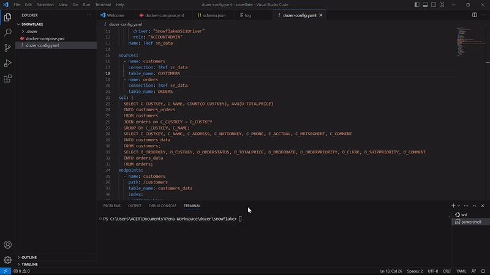
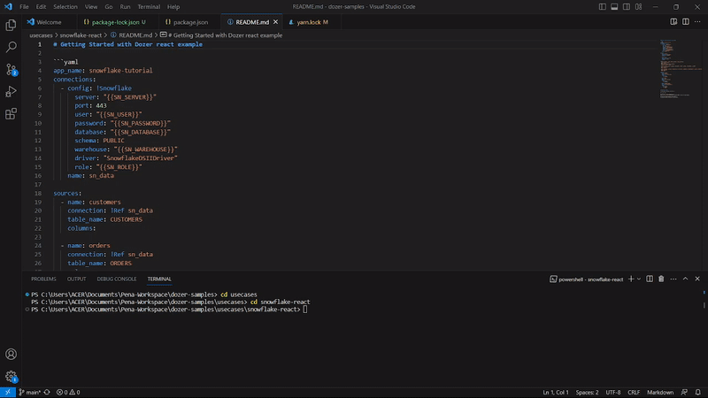
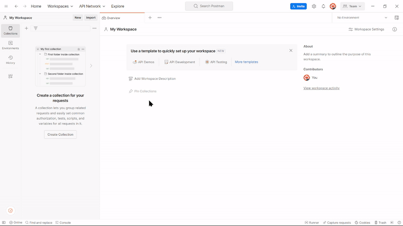

# Connecting to Snowflake
Dozer's Snowflake connector integration utilizes Snowflake's Table Streams for real-time data integration and synchronization. Using Table Streams, Dozer captures and processes data changes from Snowflake tables, ensuring instant updates without constant polling or manual synchronization.

# How to Connect Snowflake with Dozer

## Prerequisites
Before connecting Snowflake with Dozer, ensure you have already done the following:

- [Install Dozer](https://getdozer.io/docs/installation).
- [Install Docker](https://www.docker.com/).
- To connect Dozer with Snowflake, set up a Snowflake account and gather the following Snowflake parameters:

  | Parameter             | Description                                                                                                          | Integration Variable  |
  |-----------------------|----------------------------------------------------------------------------------------------------------------------|-----------------------|
  | Snowflake Account URL | Your Snowflake account URL, which you can get in your Snowflake account section.                                   | `SN_SERVER`             |
  | Snowflake Username    | Your Snowflake account's username.                                                                                  | `SN_USER`               |
  | Snowflake Password    | Your Snowflake account's password.                                                                                  | `SN_PASSWORD`           |
  | [Snowflake Database](https://docs.snowflake.com/en/user-guide/ui-snowsight-data-databases)    | Create a database within Snowflake, which will serve as your project database.        | `SN_DATABASE`           |
  | [Snowflake Warehouse](https://docs.snowflake.com/en/sql-reference/sql/create-warehouse)   | Create a warehouse within Snowflake for your project. | `SN_WAREHOUSE`          |
  | Snowflake Role        | Your Snowflake account role.                                                                                         | `SN_ROLE`               |


## Integrate Snowflake with Dozer



### Step 1: Create a Docker Provision File

To create a docker provision file, follow the steps below:

1. Create a new project directory on your local computer.
2. Create a file named `docker-compose.yml` file and fill the file with the following code:

```yaml
version: '3.9'
​
x-common-variables: &commonEnvironment
  SN_SERVER: ${SN_SERVER}
  SN_USER: ${SN_USER}
  SN_PASSWORD: ${SN_PASSWORD}
  SN_DATABASE: ${SN_DATABASE}
  SN_WAREHOUSE: ${SN_WAREHOUSE}
  SN_ROLE: ${SN_ROLE}
  APP_HOST: "0.0.0.0"
​
services:
  dozer-build:
    container_name: snowflake-dozer-build
    image: public.ecr.aws/getdozer/dozer-features:latest
    environment: *commonEnvironment
    working_dir: /usr/local/bin
    volumes:
      - ./dozer-config.yaml:/usr/local/bin/dozer-config.yaml
      - ./.dozer:/usr/local/bin/.dozer
    command:
      - /bin/sh
      - -c
      - dozer build
​
  dozer-app:
    container_name: snowflake-dozer-app
    image: public.ecr.aws/getdozer/dozer-features:latest
    environment: *commonEnvironment
    ports:
      # Internal gRPC talks to api
      - "50053:50053"
    working_dir: /usr/local/bin
    volumes:
      - ./dozer-config.yaml:/usr/local/bin/dozer-config.yaml
      - ./.dozer:/usr/local/bin/.dozer
    command:
      - /bin/sh
      - -c
      - dozer run app
    depends_on:
      dozer-build:
        condition: service_completed_successfully
    stdin_open: true
    tty: true
    healthcheck:
      test: ["CMD", "curl", "0.0.0.0:50053", "--http2-prior-knowledge"]
      interval: 1s
      timeout: 20s
      retries: 90
​
  dozer-api:
    container_name: snowflake-dozer-api
    links:
      - dozer-app
    image: public.ecr.aws/getdozer/dozer-features:latest
    environment:
      <<: *commonEnvironment
      APP_HOST: 'dozer-app'
    ports:
      # REST APIs are published on port 8080
      - "8080:8080"
      # gRPC are available over 50051
      - "50051:50051"
    depends_on:
      dozer-app:
        condition: service_healthy
    working_dir: /usr/local/bin
    volumes:
      - ./dozer-config.yaml:/usr/local/bin/dozer-config.yaml
      - ./.dozer:/usr/local/bin//.dozer
    command:
      - /bin/sh
      - -c
      - dozer run api
    stdin_open: true
    tty: true

```

3. Replace the parameters in **Environment** fields with the exported Snowflake parameters from your Snowflake account. See the code below for example:

```yaml
version: '3.9'
​
x-common-variables: &commonEnvironment
  SN_SERVER: dozer-test.snowflakecomputing.com
  SN_USER: dozerTest
  SN_PASSWORD: 'DozerSamplePassword!'
  SN_DATABASE: DOZER_SAMPLE_DATA
  SN_WAREHOUSE: COMPUTE_WH
  SN_ROLE: ACCOUNTADMIN
  APP_HOST: "0.0.0.0"
​
services:
  dozer-build:
    container_name: snowflake-dozer-build
    image: public.ecr.aws/getdozer/dozer-features:latest
    environment: *commonEnvironment
    working_dir: /usr/local/bin
    volumes:
      - ./dozer-config.yaml:/usr/local/bin/dozer-config.yaml
      - ./.dozer:/usr/local/bin/.dozer
    command:
      - /bin/sh
      - -c
      - dozer build
​
  dozer-app:
    container_name: snowflake-dozer-app
    image: public.ecr.aws/getdozer/dozer-features:latest
    environment: *commonEnvironment
    ports:
      # Internal gRPC talks to api
      - "50053:50053"
    working_dir: /usr/local/bin
    volumes:
      - ./dozer-config.yaml:/usr/local/bin/dozer-config.yaml
      - ./.dozer:/usr/local/bin/.dozer
    command:
      - /bin/sh
      - -c
      - dozer run app
    depends_on:
      dozer-build:
        condition: service_completed_successfully
    stdin_open: true
    tty: true
    healthcheck:
      test: ["CMD", "curl", "0.0.0.0:50053", "--http2-prior-knowledge"]
      interval: 1s
      timeout: 20s
      retries: 90
​
  dozer-api:
    container_name: snowflake-dozer-api
    links:
      - dozer-app
    image: public.ecr.aws/getdozer/dozer-features:latest
    environment:
      <<: *commonEnvironment
      APP_HOST: 'dozer-app'
    ports:
      # REST APIs are published on port 8080
      - "8080:8080"
      # gRPC are available over 50051
      - "50051:50051"
    depends_on:
      dozer-app:
        condition: service_healthy
    working_dir: /usr/local/bin
    volumes:
      - ./dozer-config.yaml:/usr/local/bin/dozer-config.yaml
      - ./.dozer:/usr/local/bin//.dozer
    command:
      - /bin/sh
      - -c
      - dozer run api
    stdin_open: true
    tty: true
```

### Step 2: Create a Dozer Configuration File

To integrate with Dozer, create a Dozer configuration file by following the steps below:

1. On the same directory as the `docker-compose.yml` , create a new file named ` dozer-config.yaml `.
2. Copy the code below and paste it into the `dozer-config.yaml` file:

:::note
Ensure you have replaced the Config parameters with your Snowflake parameters.
:::

```yaml
app_name: snowflake-tutorial
connections:
  - config: !Snowflake
      server: "dozer-test.snowflakecomputing.com"
      port: 443
      user: "dozerTest"
      password: "DozerSamplePassword!"
      database: "DOZER_SAMPLE_DATA"
      schema: PUBLIC
      warehouse: "COMPUTE_WH"
      driver: "SnowflakeDSIIDriver"
      role: "ACCOUNTADMIN"
    nname: !Ref sn_data

sources:
  - name: customers
    connection: !Ref sn_data
    table_name: CUSTOMERS
  - name: orders
    connection: !Ref sn_data
    table_name: ORDERS

sql: |
  SELECT C_CUSTKEY, C_NAME, COUNT(O_CUSTKEY), AVG(O_TOTALPRICE)
  INTO customers_orders
  FROM customers
  JOIN orders on C_CUSTKEY = O_CUSTKEY
  GROUP BY C_CUSTKEY, C_NAME;
​
  SELECT C_CUSTKEY, C_NAME, C_ADDRESS, C_NATIONKEY, C_PHONE, C_ACCTBAL, C_MKTSEGMENT, C_COMMENT
  INTO customers_data
  FROM customers;
​
  SELECT O_ORDERKEY, O_CUSTKEY, O_ORDERSTATUS, O_TOTALPRICE, O_ORDERDATE, O_ORDERPRIORITY, O_CLERK, O_SHIPPRIORITY, O_COMMENT
  INTO orders_data
  FROM orders;
​
endpoints:
  - name: customers
    path: /customers
    table_name: customers_data
    index:
      primary_key:
        - C_CUSTKEY
​
  - name: orders
    path: /orders
    table_name: orders_data
    index:
      primary_key:
        - O_ORDERKEY
​
  - name: customers_orders
    path: /customers_orders
    table_name: customers_orders
    index:
      primary_key:
        - C_CUSTKEY
        - C_NAME
​
api:
  app_grpc:
   host: "{{APP_HOST}}"

```

### Step 3: Run the Dozer Docker Deployment Command

Once all the necessary configurations have been arranged within your Snowflake directory, you can proceed with deploying Dozer using the Docker deployment method. This approach will facilitate the automatic deployment of Dozer in two environments: 
- Dozer Application
- REST and gRPC API Servers

1. To initiate the Dozer deployment via Docker, execute the following command:

```bash
docker-compose up
```
The command above will initiate the docker deployment and will automatically execute the following three Dozer commands:
```bash
#1 This will build the data required for the API creation
dozer build
#2 This will deploy and run the Dozer Application
dozer run app
#3 This will deploy the API in the REST and gRPC API Servers
dozer run api
```
2. Navigate to your docker, to see the deployment.




### Step 4: Query the APIs

After generating the APIs, you can try querying the APIs using the Dozer's Snowflake React interface by following the steps below:

1. Clone the **dozer-samples** repository [here](https://github.com/getdozer/dozer-samples/tree/main).
2. Go to the **usecases** > **snowflake-react**.
3. Install the **script** by running the code below:

```bash
#Windows
npm install
#MacOs
yarn Install
```

4. Start the **Snowflake React interface** by running the code below:

```bash
#Windows
npm start
#MacOs
yarn start
```

5. Navigate to [http://localhost:3000](http://localhost:3000/) to see the data generated.



An alternative approach is to utilize Postman for querying the generated example APIs. You can use the REST or gRPC Methods.

