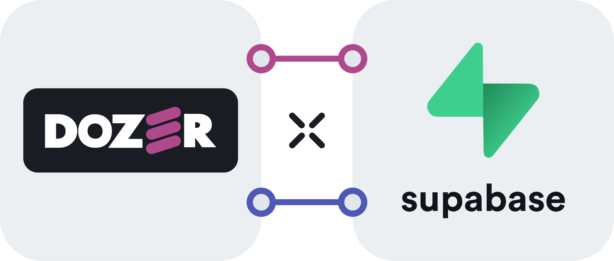

# Supabase



Dozer Supabase connector replicates data from Supabase, taking an initial snapshot of selected tables. It uses PostgreSQL's logical replication to monitor data changes continuously, sending updates to Dozer. Users can customize the configuration to optimize resource usage by selecting specific tables for replication.


## Configuration
The following configuration block can be used in `dozer-config.yaml` to define a new Supabase connection:

```yaml
connections:
  - config: !Postgres
      user: postgres
      password: postgres-dozer-123
      host: db.wlpfvdagkydbanuiqvjy.supabase.co
      port: 5432
      database: postgres
```

### Parameters

| **Parameter Name** | **Type** | **Description** | 
|--------------------|----------|-----------------|
| `user` | String | The username required for authenticating the user's access to the Supabase PostgreSQL instance. |
| `password` | String | The password corresponding to the above username, required for secure authentication to the Supabase PostgreSQL instance. |
| `host` | String or IP address | The host address of the Supabase PostgreSQL instance. |
| `port` | Integer | The specific port on which the Supabase PostgreSQL service is running. |
| `database` | String | The specific database within the Supabase PostgreSQL instance to which the connector needs to establish a connection. |

## Testing it out

To test a Supabase PostgreSQL sample, clone the `dozer-samples` GitHub repo and follow the steps described [here](https://github.com/getdozer/dozer-samples/tree/main/connectors/supabase).