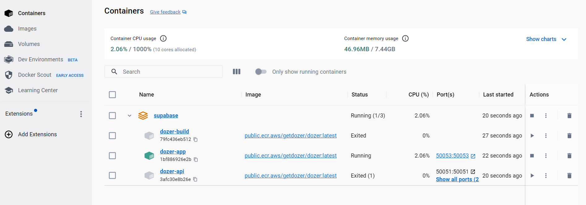
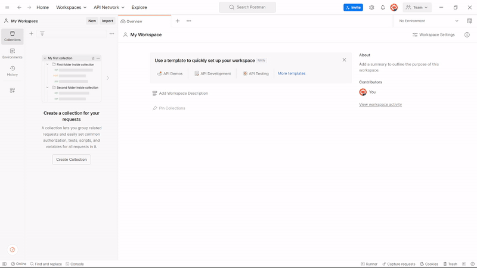

# Connecting to Supabase

This guide will walk you through the steps of adding an additional connection to a PostgreSQL database, with a specific emphasis on Supabase—a fully managed PostgreSQL database service.

# How to Connect Supabase with Dozer

## Prerequisites
Before connecting Supabase with Dozer, ensure you have already done the following:
- [Install Dozer](https://getdozer.io/docs/installation).
- [Install Docker](https://www.docker.com/).
- To connect Dozer with Supabase, set up a Supabase account, if you dont want to setup a new account, we have created a sample account for testing purpose:

  | Parameter  | Value  |
  | :------------ |:---------------| 
  | `user`     | `postgres` | 
  | `password`      | `$no_1_enter$`        | 
  | `host` | `db.fawvjxbsdfxeavxetmmx.supabase.co`        | 
  | `port` | `5432`       |   

## Integrate Supabase with Dozer


### Step 1: Create a Docker Provision File

To create a docker provision file, follow the steps below:

1. Create a new project directory on your local computer.
2. Create a file named `docker-compose.yml` file and fill the file with the following code:

```yaml
version: '3.9'
​
x-common-variables: &commonEnvironment
  PG_USER: ${PG_USER}
  PG_PASSWORD: ${PG_PASSWORD}
  PG_HOST: ${PG_HOST}
  PG_PORT: ${PG_PORT}
  PG_DB: ${PG_DB}
  APP_HOST: "0.0.0.0"
​
services:
  dozer-build:
    container_name: dozer-build
    image: public.ecr.aws/getdozer/dozer:latest
    environment: *commonEnvironment
    working_dir: /usr/local/bin
    volumes:
      - ./dozer-config.yaml:/usr/local/bin/dozer-config.yaml
      - ./.dozer:/usr/local/bin/.dozer
    command:
      - /bin/sh
      - -c
      - dozer build
​
  dozer-app:
    container_name: dozer-app
    image: public.ecr.aws/getdozer/dozer:latest
    environment: *commonEnvironment
    ports:
      # Internal gRPC talks to api
      - "50053:50053"
    working_dir: /usr/local/bin
    volumes:
      - ./dozer-config.yaml:/usr/local/bin/dozer-config.yaml
      - ./.dozer:/usr/local/bin/.dozer
    command:
      - /bin/sh
      - -c
      - dozer run app
    depends_on:
      dozer-build:
        condition: service_completed_successfully
    stdin_open: true
    tty: true
    healthcheck:
      test: ["CMD", "curl", "0.0.0.0:50053", "--http2-prior-knowledge"]
      interval: 1s
      timeout: 20s
      retries: 90
​
  dozer-api:
    container_name: dozer-api
    links:
      - dozer-app
    image: public.ecr.aws/getdozer/dozer:latest
    environment:
      <<: *commonEnvironment
      APP_HOST: 'dozer-app'
    ports:
      # REST APIs are published on port 8080
      - "8080:8080"
      # gRPC are available over 50051
      - "50051:50051"
    depends_on:
      dozer-app:
        condition: service_healthy
    working_dir: /usr/local/bin
    volumes:
      - ./dozer-config.yaml:/usr/local/bin/dozer-config.yaml
      - ./.dozer:/usr/local/bin//.dozer
    command:
      - /bin/sh
      - -c
      - dozer run api
    stdin_open: true
    tty: true
```

3. Replace the parameters in **Environment** fields with the Supabase sample account parameters. See the code below for example:

```yaml
version: '3.9'

x-common-variables: &commonEnvironment
  PG_USER: postgres
  PG_PASSWORD: postgres-dozer-123
  PG_HOST: db.wlpfvdagkydbanuiqvjy.supabase.co
  PG_PORT: 5432
  PG_DB: postgres
  APP_HOST: "0.0.0.0"

services:
  dozer-build:
    container_name: dozer-build
    image: public.ecr.aws/getdozer/dozer:latest
    environment: *commonEnvironment
    working_dir: /usr/local/bin
    volumes:
      - ./dozer-config.yaml:/usr/local/bin/dozer-config.yaml
      - ./.dozer:/usr/local/bin/.dozer
    command:
      - /bin/sh
      - -c
      - dozer build

  dozer-app:
    container_name: dozer-app
    image: public.ecr.aws/getdozer/dozer:latest
    environment: *commonEnvironment
    ports:
      # Internal gRPC talks to api
      - "50053:50053"
    working_dir: /usr/local/bin
    volumes:
      - ./dozer-config.yaml:/usr/local/bin/dozer-config.yaml
      - ./.dozer:/usr/local/bin/.dozer
    command:
      - /bin/sh
      - -c
      - dozer run app
    depends_on:
      dozer-build:
        condition: service_completed_successfully
    stdin_open: true
    tty: true
    healthcheck:
      test: ["CMD", "curl", "0.0.0.0:50053", "--http2-prior-knowledge"]
      interval: 1s
      timeout: 20s
      retries: 90

  dozer-api:
    container_name: dozer-api
    links:
      - dozer-app
    image: public.ecr.aws/getdozer/dozer:latest
    environment:
      <<: *commonEnvironment
      APP_HOST: 'dozer-app'
    ports:
      # REST APIs are published on port 8080
      - "8080:8080"
      # gRPC are available over 50051
      - "50051:50051"
    depends_on:
      dozer-app:
        condition: service_healthy
    working_dir: /usr/local/bin
    volumes:
      - ./dozer-config.yaml:/usr/local/bin/dozer-config.yaml
      - ./.dozer:/usr/local/bin//.dozer
    command:
      - /bin/sh
      - -c
      - dozer run api
    stdin_open: true
    tty: true
```

### Step 2: Create a Dozer Configuration File

To integrate with Dozer, create a Dozer configuration file by following the steps below:

1. On the same directory as the `docker-compose.yml` , create a new file named ` dozer-config.yaml `.
2. Copy the code below and paste it into the `dozer-config.yaml` file:

:::note
Ensure you have replaced the Config parameters with the test Supabase account parameters.
:::

```yaml
app_name: local-supabase-sample

connections:
  - config: !Postgres
      user: postgres
      password: postgres-dozer-123
      host: db.wlpfvdagkydbanuiqvjy.supabase.co
      port: 5432
      database: postgres
    name: pg

sources:
  - name: zones
    table_name: zones
    connection: pg

sql: |
  SELECT * INTO zone_data FROM zones;

endpoints:
  - name: zone_data
    path: /zone_data
    table_name: zone_data

api:
  app_grpc:
   host: "0.0.0.0"

```

### Step 3: Run the Dozer Docker Deployment Command

Once all the necessary configurations have been arranged within your Supabase directory, you can proceed with deploying Dozer using the Docker deployment method. This approach will facilitate the automatic deployment of Dozer in two environments: 
- Dozer Application
- REST and gRPC API Servers

1. To initiate the Dozer deployment via Docker, execute the following command:

```bash
docker-compose up
```
The command above will initiate the docker deployment and will automatically execute the following three Dozer commands:
```bash
#1 This will build the data required for the API creation
dozer build
#2 This will deploy and run the Dozer Application
dozer run app
#3 This will deploy the API in the REST and gRPC API Servers
dozer run api
```
2. Navigate to your docker, to see the deployment.



### Step 4: Query the APIs

You can query the APIs using Postman's REST (HTTP) method or the gRPC method.


