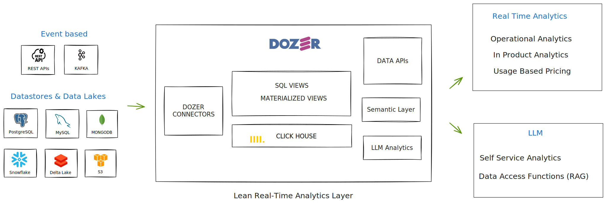

# Introduction

Dozer is a Real-Time Analytical Layer for your LLMs and Data Products.  It enables easy real-time data products development, deployment and maintenance. Aim of the product is to enable developers to build customer facing analytical products without having to worry about building infrastructure. Dozer is built in Rust and utilises Clickhouse for serving low latency analytics.

By default each account is provisioned with a generous free tier on a multi node cluster offering high availability and scalability out of the box. 

In summary, Dozer provides a straightforward way for developers to build and deploy real-time scalable data products.

