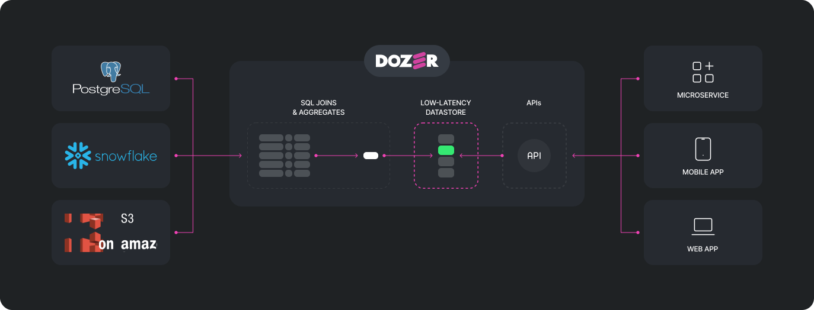

# Introduction

Dozer is a Data API backend platform, engineered primarily to distribute data via low-latency APIs (gRPC and REST), enabling seamless integration with customer-facing applications and downstream systems. It interfaces with a diverse array of data sources, such as databases, data lakes, and warehouses, utilizing Change Data Capture (CDC) for databases and periodic polling for data lakes and warehouses to keep the data fresh and up-to-date.

A standout feature of Dozer is its integrated streaming SQL engine, which enables all sourced data to be joined and transformed in real-time. This real-time transformation and aggregation feature facilitates dynamic data manipulation, providing users with the exact data they require at the right moment.

Additionally, Dozer includes a low-latency datastore where transformed data is stored. This feature allows for high-speed data retrieval, ensuring data accessibility with minimal delay, a critical requirement for customer-facing applications.

Drawing similarities with a Content Delivery Network (CDN), Dozer aims to bring data and APIs closer to the end user. This drastically reduces latency, optimizes performance, and enables the capacity to handle high-volume data operations efficiently. Furthermore, Dozer's distributed architecture ensures scalability and high availability.

## Why Dozer ?
As teams embark on the journey of implementing real-time data applications, they invariably come across a host of challenges that can make the task seem daunting:

1. **Integration with Various Systems**: Integrating the data application with various data sources and downstream systems can present numerous technical hurdles and interoperability issues.

2. **Managing Latency**: Ensuring low-latency data access, especially for customer-facing applications and downstream systems, can be a significant challenge. High latency can lead to slow application performance and poor user experience.

3. **Real-Time Data Transformation**: Managing real-time data transformations, especially when dealing with complex queries or large volumes of data, can be difficult and resource-intensive. 

4. **Maintaining Data Freshness**: Keeping the data up-to-date in real-time, particularly when it's sourced from multiple locations like databases, data lakes, or warehouses, can be a daunting task.

4. **Scalability and High Availability**: Building a data application that can efficiently handle high-volume operations and remain reliable under heavy loads requires advanced architecture design and robust infrastructure.

To address all the above issues, teams often find themselves stitching together multiple technologies and a significant amount of custom code. This could involve integrating diverse systems like Kafka for real-time data streaming, Redis for low-latency data access and caching, and Spark or Flink for processing and analyzing streaming data. Below is a typical setup:

The complexity of such a setup can become overwhelming. Ensuring that these different technologies communicate effectively, maintaining them, and handling potential failure points requires extensive effort and expertise.

This is where Dozer steps in, aiming to dramatically simplify this process. Dozer is designed as an all-in-one backend solution that integrates the capabilities of these disparate technologies into a single, streamlined tool. By doing so, Dozer offers the capacity to build an end-to-end real-time data application without the need to manage multiple technologies and extensive custom code.

## Key Features

1. **Integration with Various Systems**: Dozer is designed to seamlessly integrate with a variety of data sources such as Databases like PostgreSQL, MySQL (coming soon) and MongoDB (coming soon), Data Warehouses like Snowflake and Databricks and file formats like Parquet, Deltalake and CSV. Dozer also implements a connector framework that makes it very easy to support new input formats.

1. **Low-Latency Data Access and API**: Dozer enables low-latency data access and API execution, critical for delivering smooth user experiences and real-time application responses. It offer both gRPC and REST interfaces.

2. **Integrated Streaming SQL Engine**: Dozer features an embedded streaming SQL engine that enables real-time data transformation. This means data from different sources can be joined and transformed on-the-fly.

3. **Embedded Low-Latency Datastore**: To ensure rapid access to data, Dozer comes with a built-in low-latency datastore (based on the Lightning Memory-Mapped Database - LMDB) for storing transformed data. This optimizes the data retrieval process, making it efficient and quick.

4. **Real-Time Data Freshness**: Dozer offers real-time data freshness by using techniques like Change Data Capture (CDC) and periodic polling to detect changes in near real-time, ensuring that your data is always up-to-date.

5. **Scalability and High Availability**: Designed to handle high-volume operations, Dozer provides scalability and high availability. This ensures the robustness of your application, even under heavy loads.

8. **Security and Authorization**: Dozer is designed with robust security measures in place, providing secure data access, and also includes features for managing access and authorization to ensure that only authorized users can access specific data.

## How does it compare to ... ?

### Redis
Redis, an in-memory data structure store, is often used as a database, cache, and message broker, delivering exceptional speed for in-memory operations. However, when used as a cache, one of the biggest challenges is determining the appropriate TTL (Time to Live) for each record, which essentially determines the freshness of the data.

In contrast, Dozer is an advanced data management tool designed specifically for real-time or near real-time data ingestion from diverse sources. It leverages Change Data Capture (CDC) mechanisms to ensure that data is always fresh, avoiding the complexities of managing TTLs associated with traditional caching solutions. Moreover, Dozer is more than just a data store - it also offers a streaming SQL engine for real-time data transformations and aggregation, and actively distributes data and APIs closer to the end user, similar to a Content Delivery Network (CDN).

### Hasura
Hasura is a powerful GraphQL engine that connects directly to your databases and microservices and auto-generates a production-ready GraphQL API. However, its performance is contingent on the underlying database it's querying. This can lead to slower responses and increased load on your source system, especially with complex queries or large datasets.

Contrarily, Dozer operates differently by leveraging Change Data Capture (CDC) to continuously synchronize data from the source system to its own in-built store. This store is specifically optimized for high-speed data read operations. This not only ensures fresher data, but also significantly reduces the load on the source system, and provides consistent low-latency responses, regardless of query complexity.

### Cube.js
Cube.js is a robust analytics API layer, designed to facilitate creating aggregate data queries and supporting complex analytics tasks. Its strength lies in the ability to generate metrics and visualizations for business intelligence applications.

### Materialize and RisingWave
Materialize and RisingWave are streaning databases.

Dozer, however, is engineered as a comprehensive data API backend, aiming to simplify the real-time data application building process. It ingests data continuously from different sources through CDC or period polling, processes it using its embedded streaming SQL engine, and then stores it in an optimized low-latency datastore. Beyond just maintaining updated views of data, Dozer offers a complete end-to-end solution, integrating real-time data transformation, storage, and distribution closer to the end user through its APIs.

## Why Dozer Cloud ?
Dozer Cloud is our fully-managed solution for real-time data application development. Leveraging the power and scalability of cloud services, it simplifies the process and boosts productivity. With features like enhanced connectivity, automated deployments, and improved observability, Dozer Cloud is an end-to-end solution that mitigates common development challenges. Here's a look at the key capabilities of Dozer Cloud:

1. **Dynamic Scalability**: Dozer Cloud service automatically scales up and down according to load variations, smoothly accommodating a range of data processing needs.

2. **Geographically Distributed Data and APIs**: Leveraging the global infrastructure of cloud providers, Dozer Cloud distributes data and APIs closer to end users for reduced latency and improved user experiences.

5. **Automated API Versioning and Blue-Green Deployments**: Dozer Cloud incorporates automated API versioning and blue-green deployment strategies. This means that your team can seamlessly roll out updates, minimize downtime during deployments, and quickly roll back if necessary.

6. **Enhanced Security and Compliance**: With advanced cloud security measures in place, Dozer Cloud offers enhanced access control and compliance with various regulatory standards.

7. **Extended Connectivity**: Dozer Cloud provides additional connectors to enterprise databases like Oracle, broadening Dozer's data ingestion capabilities.

8. **Enhanced Observability and Monitoring Integration**: Dozer Cloud offers improved observability features and easily integrates with monitoring tools like Prometheus, offering insights into system health and performance metrics.

11. **Automated Data Recovery**: Leveraging cloud capabilities, Dozer provides automated backups and a robust disaster recovery plan to ensure data application resilience.
