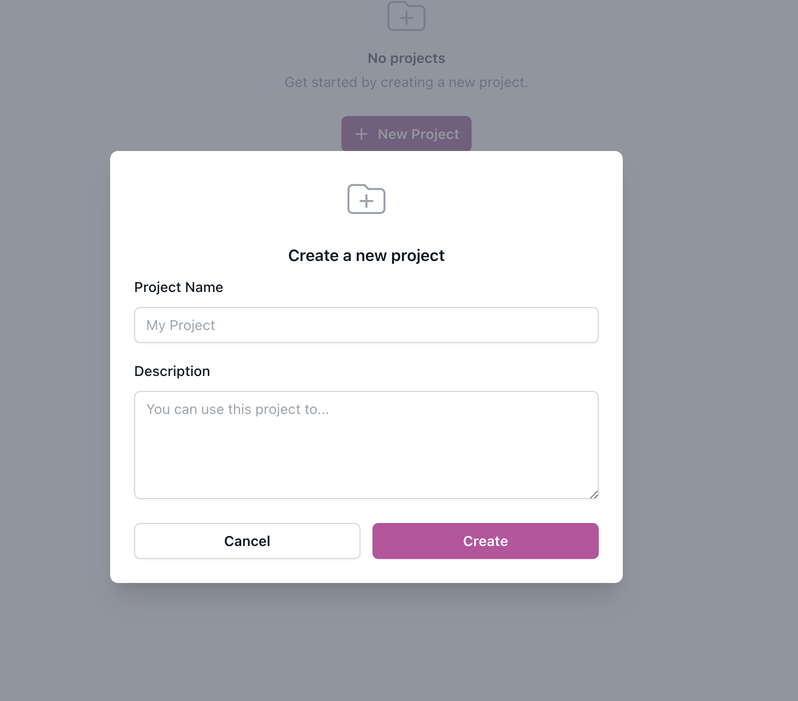
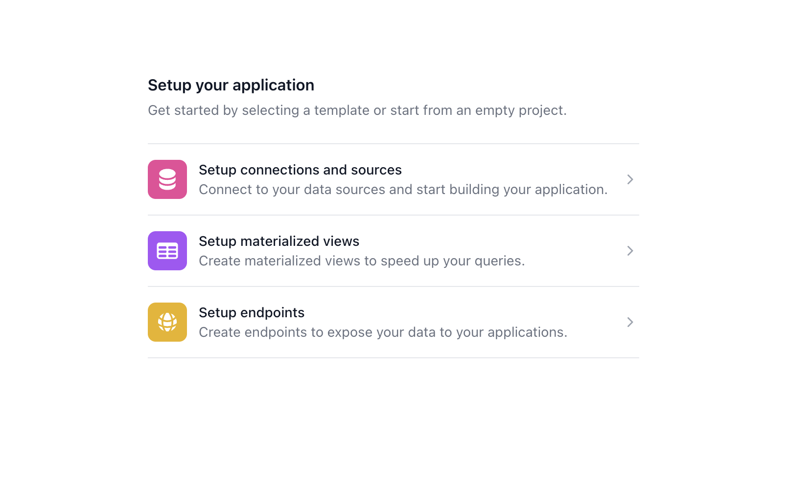
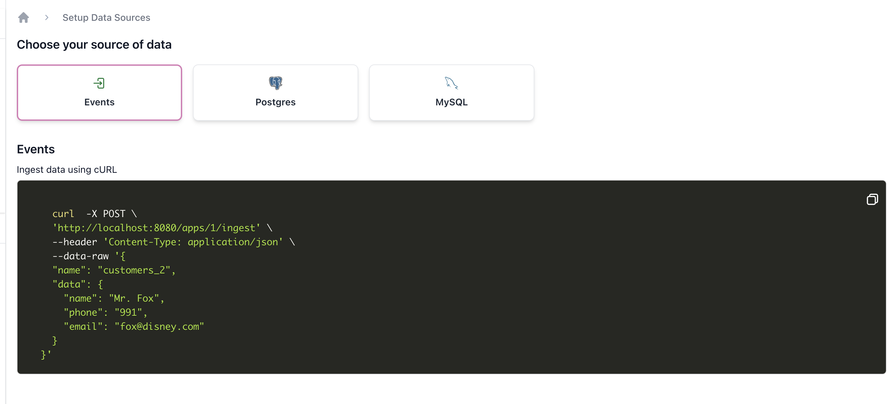
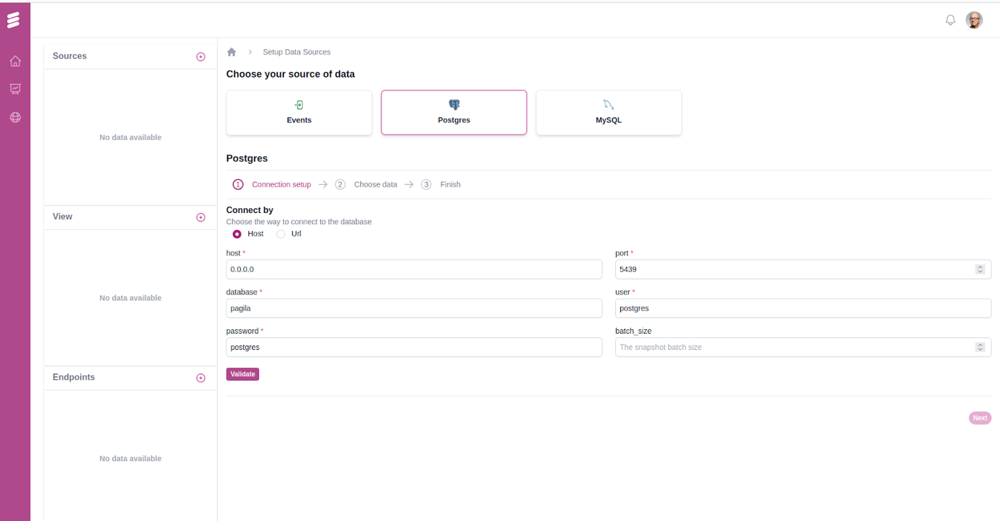
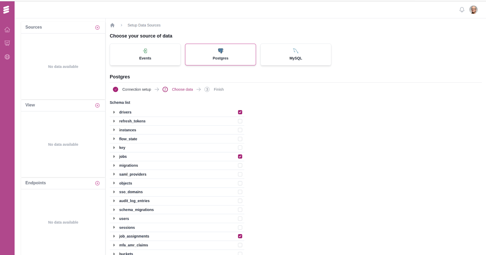
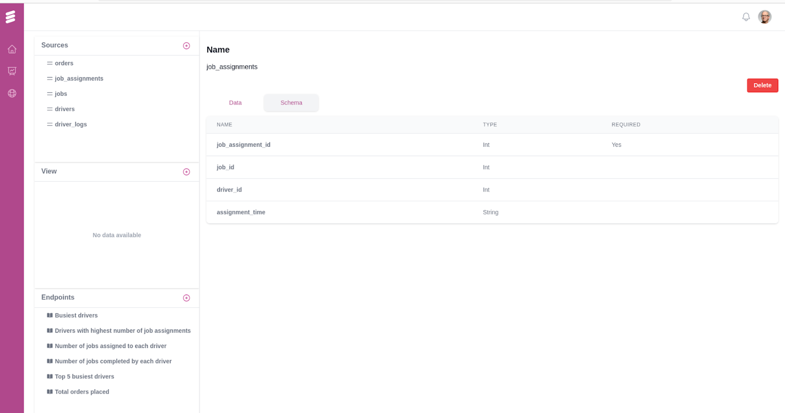
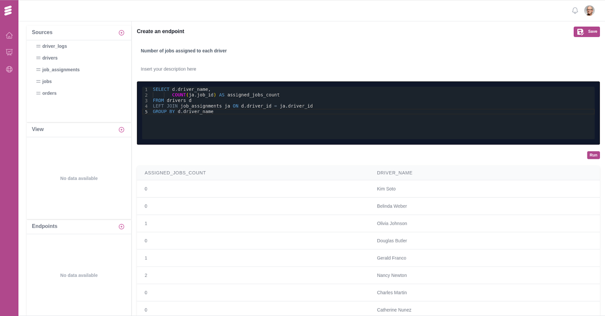

# Getting Started
For getting started with Dozer Analytics, create a new account at https://cloud.getdozer.io.

## Setup Project
 Once logged in, users are directed to the Pulse dashboard, offering the ability to create multiple projects tailored to their specific needs. Start by creating a new project.

. 

## Configure Project

You will be prompted to configure the project. You can do the following things using Dozer Pulse immediately. 




## Ingest Data


Start ingesting data by leveraging one of the two methods. 

There are two ways developers can ingest data into Dozer. 
- [Event Based Approach](#event-based)
- [Dozer Connectors via CDC](#data-stores-data-lakes--files)

#### Event Based 
Developers can conveniently push data to Dozer using REST APIs which will be the easiest way to get started. Or if you are already leveraging Kafka `Dozer` can pull data from Kafka using Schema Registry for message parsing.

Typically you would ingest transactional or high volume data using this method. Dozer and Clickhouse boast amazing ingestion speeds when compared to other tools. 


#### Ingest a sample Event
Click on the (+) Add Data Source and select Events. You can try ingesting a sample record using the ingest API. 



#### Sample Event
```bash

    curl  -X POST \
    'https://cloud.getdozer.io/apps/1001/ingest' \
    --header 'Content-Type: application/json' \
    --data-raw '{
    "name": "customers_2",
    "data": {
      "name": "Mr. Fox",
      "phone": "991",
      "email": "fox@disney.com"
    }
  }'
```

#### Data Stores, Data Lakes & Files

Dozer utilizes `Dozer Connectors` for keeping upto date with all the databases. It pulls data from various sources like databases, data lakes, and warehouses using Change Data Capture (CDC) and periodic polling mechanisms. This ensures up-to-date data ingestion in real-time or near-real-time.

#### Ingest sample data from a Datastore

Click on the (+) Add Data Source and select a database (currently supporting Postgres and MySQL). Input the relevant connection details like host address, port, username, and password.




Once the connection to the source database is confirmed, a list of all available tables within the connected database is presented. From this list, users have the option to manually select and adjust which tables are to be replicated to the ClickHouse sink for subsequent analytics processing.



Once all the steps are completed, users can access all tables from multiple sources in the "Sources" section. Additionally, all created endpoints and views are conveniently displayed next to the sidebar.

Users can easily view data records and schema information for each source table for quick reference. For instance, the schema for the job_assignments table can be viewed as follows:



## Create an Endpoint

Now that you have access to a datasource, you can create an endpoint with a query. 
- Click on the (+) Add Endpoint and input the endpoint name, description, and the SQL query you want to execute on the underlying Clickhouse database.



- Alterntatively, you can create an endpoint by executing the following curl command.

```bash

    curl  -X POST \
    'https://cloud.getdozer.io/apps/1001/endpoints' \
    --header 'Content-Type: application/json' \
    --data-raw '{
    "name": "customers_2",
    "query": "SELECT COUNT(*) as customer_count from customers"
  }'
  
```

Voila! You have created your first endpoint. Now you can use this as an API for calling Dozer Endpoint.