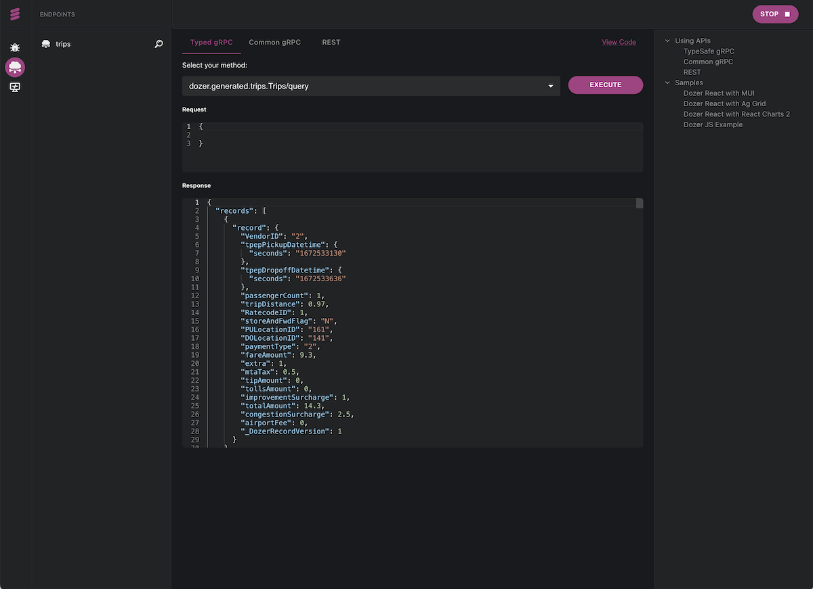

import Tabs from '@theme/Tabs';
import TabItem from '@theme/TabItem';

# Connecting to Sources

We will be working with two distinct datasets from the [NY taxi dataset](https://www.nyc.gov/site/tlc/about/tlc-trip-record-data.page): the *trips* dataset, encompassing a range of trip details, and the *zones* dataset, which serves as a reference lookup for various New York zones. Notably, the *trips* data will be sourced from basic text files, whereas the *zones* data will be retrieved directly from a PostgreSQL database. As we navigate through this process, we will also illustrate how Dozer performs on-the-fly transformations and effectively exposes APIs.

::::info
This tutorial can be run using **Dozer Live** or **Dozer CLI**. Dozer Live is an interactive browser-based UI for faster development,
while Dozer CLI is the standard Dozer Command Line Interface. 

Select the desired option, and follow the steps below:

<Tabs groupId="tool">
  <TabItem value="live" label="Dozer Live">
  </TabItem>
  <TabItem value="cli" label="Dozer CLI">
  </TabItem>
</Tabs>

::::

## Sourcing trips data from local storage

Open a new file `dozer-config.yaml` and add the following configuration section:

```yaml
cache_max_map_size: 10737418240
app_name: ny-taxi-sample
connections:
  - config: !LocalStorage
      details:
        path: ./data
      tables:
        - !Table
          name: trips
          config: !Parquet
            path: trips
            extension: .parquet
    name: local_storage

sources:
  - name: trips
    table_name: trips
    connection: local_storage

endpoints:
  - name: trips
    path: /trips
    table_name: trips
```

Now download some sample trip data and copy it to the `data/trips` directory:

```bash 
curl --create-dirs -o \
  data/trips/yellow_tripdata_2023-01.parquet \
  https://d37ci6vzurychx.cloudfront.net/trip-data/yellow_tripdata_2023-01.parquet
```

<Tabs groupId="tool">
<TabItem value="live" label="Dozer Live">

Start Dozer Live with the command:
```bash
dozer live
```
This will open your browser and redirect you to the Dozer Live UI.

::::note
The first time you kickstart Dozer Live, a registration page will make its grand entrance. This is just our curious side wanting to know a bit more about our awesome users. Rest assured, any details you choose to share are simply for our learning and are completely optional.
::::

The following page will appear:


This displays all connections, sources, endpoints and a Directed Acyclic Graph (DAG) of the data processing pipeline. Click on the <div className="live-button">RUN ▶</div> button on the upper right 
corner to start ingesting the data. Dozer Live will load a progress panel in the lower part of the screen informing you about the data processing progress.


Once started, click on the **Endpoints** icon (the second from the top) on the left toolbar, which will load the following screen: 



This screen allows you to start querying Dozer using REST and gRPC. Simply click on the <div className="live-button">EXECUTE</div> button to start querying the Dozer store.
Nowe we can click on the <div className="live-button">STOP ⏹</div> button and add one more connection to our `dozer-config.yaml`.


  </TabItem>

  <TabItem value="cli" label="Dozer CLI">

Start Dozer with the command:

```bash
dozer --enable-progress
```

You should be seeing a screen like the following
```
 INFO starting 10 workers
▹▹▹▹▸ trips: 3066000: 1,123,447.5798/s
▹▹▹▹▸ trips: 3065488: 196,977.7552/s
▸▹▹▹▹ reader: trips: 1530382: 141,610.4148/s
```

This means Dozer is succesfully running. To validate that, you can run a simple REST query:

```bash
curl -X POST  http://localhost:8080/trips/query \
  --header 'Content-Type: application/json' --data-raw '{"$limit":3}'
```

This will retrieve the first 3 records from the `trips` collection.
  </TabItem>
</Tabs>


## Adding a PostgreSQL connection

We will now be adding a second connection to a PostgreSQL database. For simplicity, we will use [Supabase](htpps://www.supabase.com), a fully managed PostgreSQL database service.

Head over to [Supabase](htpps://www.supabase.com) and create a new project. Create a new table named `zones` and import the data from [this CSV file](https://d37ci6vzurychx.cloudfront.net/misc/taxi+_zone_lookup.csv). To do that, click on the button **Import data via spreadsheet** when creating a  new table in Supabase. Upload the CSV file and select `LocationID` as primary key.

Once created, head over to your project settings in Supabase, click on **Database** and take note of the **Connection Info** details. These will be used in the Dozer configuration to connect to this database instance.

Now edit your `dozer-config.yaml` and add a new PostgreSQL connection, a new source and a new endpoint. The new `dozer-config.yaml` file should look like this:

```yaml
cache_max_map_size: 10000000000
app_name: ny-taxi-sample
connections:
  - config: !LocalStorage
      details:
        path: ./data
      tables:
        - !Table
          name: trips
          config: !Parquet
            path: trips
            extension: .parquet
    name: local_storage

  - config: !Postgres
      user: ** Your Supabase user ** (generally postgres)
      password: ** Your Supabase password **
      host: ** Your Supabase host **
      port: ** Your Supabase port ** (generally 5432)
      database: postgres
    name: pg

sources:
  - name: trips
    table_name: trips
    connection: local_storage

  - name: zones
    table_name: zones
    connection: pg

endpoints:
  - name: trips
    path: /trips
    table_name: trips

  - name: zones
    path: /zoness
    table_name: zones

```

<Tabs groupId="tool">
  <TabItem value="live" label="Dozer Live">

As you change anything in the `dozer-config.yaml` you will notice that configuration is re-loaded. You will notice that a new collection called `zones` will be available.
You can click on the <div className="live-button">RUN ▶</div> again to restart the application and query the new data. In the next section we will be adding SQL transformations to our data sources.

  </TabItem>
  <TabItem value="cli" label="Dozer CLI">

Now you can restart Dozer. You will notice that a new collection called `zones` is available. In the next section we will be adding SQL transformations to our data sources.

  </TabItem>
</Tabs>
