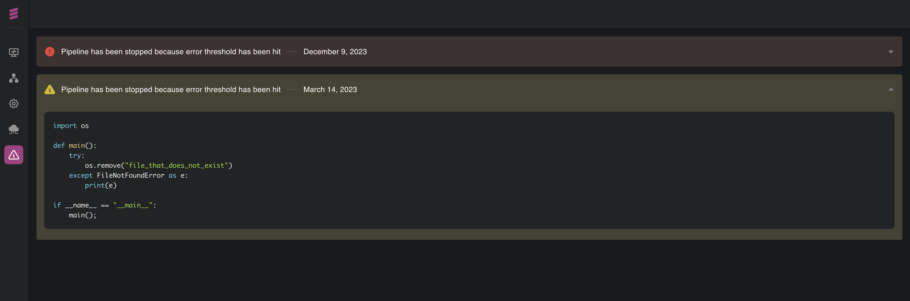

# Monitoring your Application

Dozer UI provides its dashboard to monitor the Application. It consists in different charts which show different parameters of your application.  On the menu, on the left side of the dashboard, you can find different tabs. Let's take a look at each of them.

## Login in Dozer

To monitor your Dozer Application, the first step is to log in, by entering the email and password.

## 📊 Dashboard

The very first dashboard is an overview of many important settings of your application. For the dashboard you can take these actions:
* refresh dashboard,
* set the time interval, 
* set end date.

All these settings are located in the upper-right corner of the window.

A set of monitoring tools are located in the menu on the left. Let's describe more in detail each tab of this menu.

##   Overview

This dashboard shows graphical representations of Sources, Stores, and Pods. You can monitor Sources in:
* Total Operations,
* Operations per second,
* Pipeline Latency

You can monitor Store's parameters:
* Total Operations,
* Operations per second,
* Data Latency

For each Pod, in the Overview tab, you can see the parameters:
* Instance
* Status
* Disk Usage
* Ram Usage
* AVG/R Sec
* Restart
* Created

Each of these components of Overview is represented more in detail in a separate tab in the menu.

##  Source

The second tab of the menu will show you a dashboard of data sources in your application. It will show a chart of Total Operations

Another detailed chart shows Operations performed per Second.

For each chart, you can select the table and the operation type you want to monitor.

##  Pipeline
The third tab of the menu consists in monitoring the pipelines of your application. It gives a detailed chart of Pipeline Latency

Here, you will have a detailed Execution Plan for each operation, for example of JOIN operations performed in the data source.

A third monitor is about the Containers in the pipeline, such as Instance, Status, Disk Usage, and RAM usage.

##   API
The fourth tab consists in monitoring the API endpoints of your application. You will get a detailed view of the charts:
* Cache: graphical representation of Data Latency and Total Operations
* Indexing: graphical representation of Total Indexed Records and Indexing Rate per Second
* API: graphical representation of API Latency and API Throughput.

##  Errors

In the last tab of the menu, you will have detailed information about all errors which might encounter in the application. 

