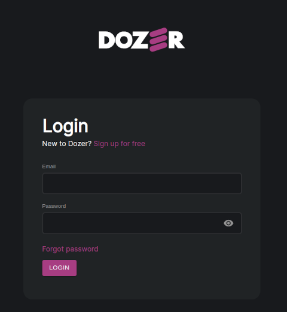
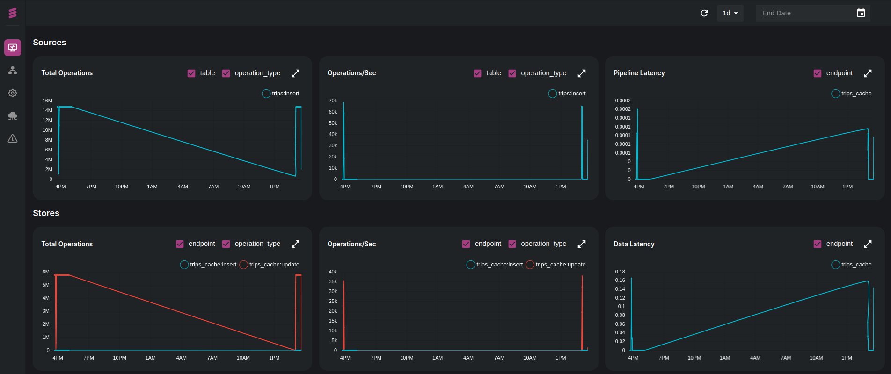
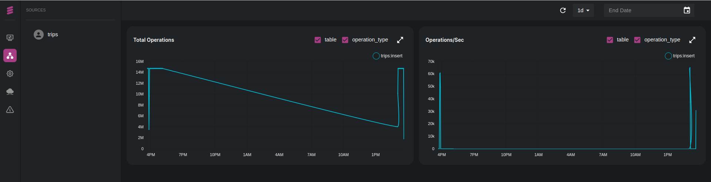
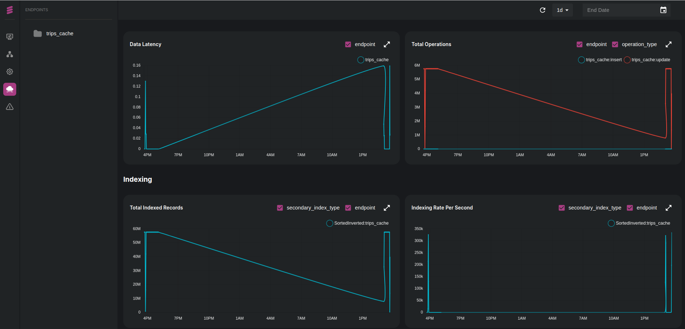

# Monitoring your Application
Dozer UI provides its dashboard to monitor the application. 

## Installing Dozer UI
To install the Dozer UI and to start monitoring your application, let's follow these steps:

1. Download *dozer-ui-lite*, by writing the command in the terminal:
* For Linux
```bash
curl -sLO https://raw.githubusercontent.com/getdozer/dozer-docs/main/static/examples/3_ui_lite/dozer-ui-lite.tar.gz && tar -zxvf dozer-ui-lite-linux.tar.gz
```

 * For other architectures

```bash
curl -sLO https://raw.githubusercontent.com/getdozer/dozer-docs/main/static/examples/3_ui_lite/dozer-ui-lite.tar.gz && tar -zxvf dozer-ui-lite.tar.gz
```

2. Go to the subfolder when you downloaded the dozer-ui-lite, by writing the command:
```bash
cd dozer-ui-lite
```
3. Dozer UI works as a Docker Container. You can find more guides in [Docker Overview](https://docs.docker.com/get-started/overview/). This step involves the Docker Command:

```bash
docker-compose up
```

4. Now, open a new tab in the Browser. The Dozer UI is located at this address:

`localhost:3000`

### Check the Installation
During the installation of Dozer, there is created a file named *dozer-config.yaml* which is located in the same folder where you did the Dozer installation. 

To check if the *dozer-ui-lite* is running properly, make sure the *dozer-config.yaml* file contains these lines:


```docker
telemetry:
  metrics: !Prometheus 
```

*Prometheus* is a standalone open-source project that collects and stores its metrics as time series data. You can find an introduction in the [Prometheus Overview](https://prometheus.io/docs/introduction/overview/).

Also, you can access the Prometheus metrics, by opening a new tab in browser, and go to the address:
```
localhost:9090/graph
```

## Login in Dozer-UI

First, start running the Dozer application, by writing this command in the terminal, within the folder you have the Dozer application:

```bash
dozer
```
You will see the Dozer logo, and information about the application, similar to this:

```bash
Dozer Version: 0.1.32

 INFO Initiating app: local-storage-sample    
 INFO Home dir: ./.dozer    
 INFO [API] Configuration

```

Now, open a new tab in the browser and go to the address:
```
localhost:3000
```
Here you can monitor the Dozer applications. 
The first step is to Sign Up, by entering the email and a valid password.




The overview dashboard consists in different charts which show different parameters of your application.  On the menu, on the left side of the dashboard, you can find different tabs. Let's take a look at each of them.

## Dashboard

The dashboard is an overview of many important settings of your application. For the dashboard you can take these actions:
* refresh dashboard,
* set the time interval, 
* set end date.

All these settings are located in the upper-right corner of the window.


A set of monitoring tools are located in the menu on the left. Let's describe more in detail each tab of this menu.


##   Overview

This dashboard shows graphical representations of Sources, Stores, and Pods. You can monitor:
* Sources: Total Operations, Operations per second, and Pipeline Latency.
* Store: Total Operations, Operations per second, Data Latency.
* Pod: Instance, Status, Disk Usage, RAM Usage, AVG/R Sec, Restart, and Created.



Each of these components of Overview is represented more in detail in a separate tab in the menu.


##  Source

The second tab of the menu will show you a dashboard of data sources in your application. It will show a chart of Total Operations

Another detailed chart shows Operations performed per Second.



For each chart, you can select the table and the operation type you want to monitor.


##  Pipeline
The third tab of the menu consists in monitoring the pipelines of your application. It gives a detailed chart of Pipeline Latency


Here, you will have a detailed Execution Plan for each operation, for example of JOIN operations performed in the data source.

A third monitor is about the Containers in the pipeline, such as Instance, Status, Disk Usage, and RAM usage.

##   API
The fourth tab consists in monitoring the API endpoints of your application. You will get a detailed view of the charts:
* Cache: graphical representation of Data Latency and Total Operations
* Indexing: graphical representation of Total Indexed Records and Indexing Rate per Second
* API: graphical representation of API Latency and API Throughput.



##  Errors


In the last tab of the menu, you will have detailed information about all errors which might encounter in the application. 


