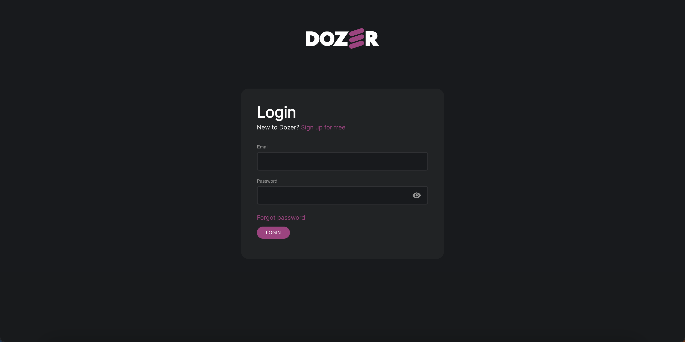
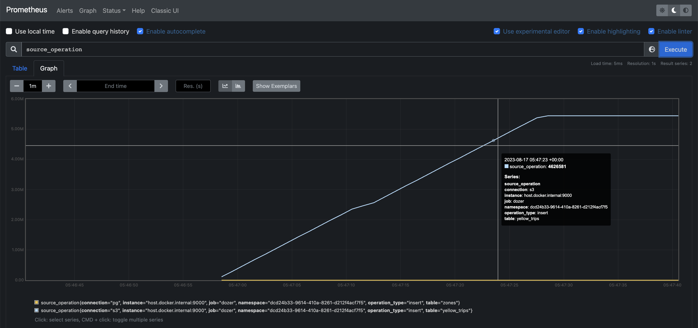
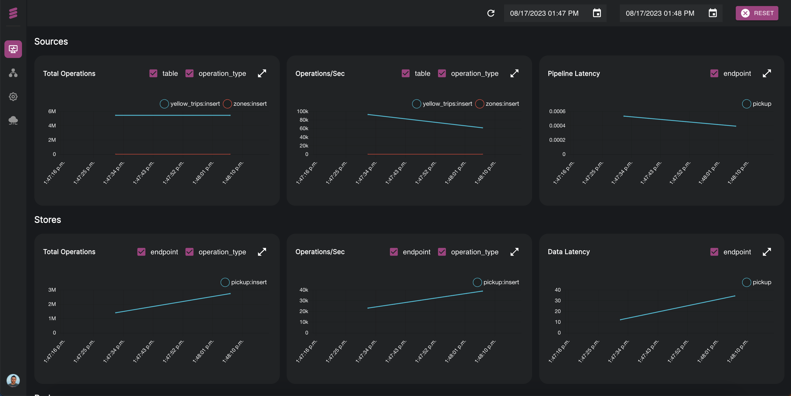
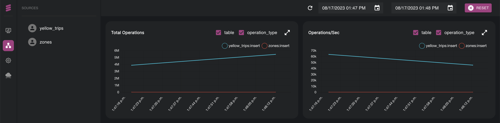
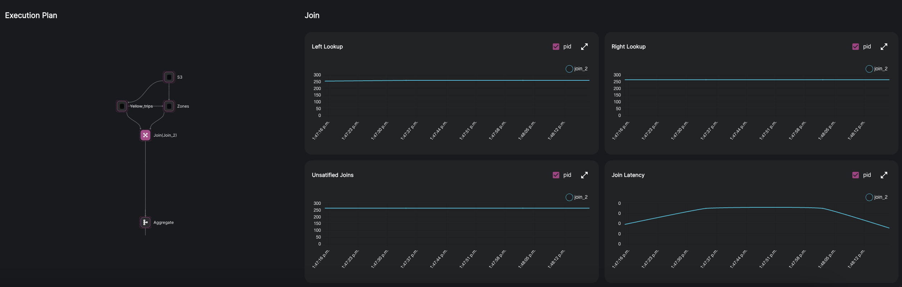
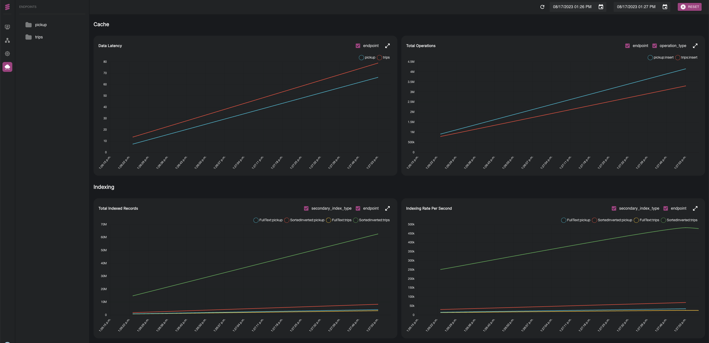

# Monitoring Applications

## Dozer UI Lite Setup
To install the Dozer UI Lite and to start monitoring your applications locally, follow these steps.

### Installation

Download ***dozer-ui-lite***, by running following commands.
```bash
# MacOS
curl -sLO https://raw.githubusercontent.com/getdozer/dozer-docs/main/static/examples/3_ui_lite/dozer-ui-lite.tar.gz
tar -zxvf dozer-ui-lite.tar.gz
cd dozer-ui-lite
```
```bash
# Ubuntu
curl -sLO https://raw.githubusercontent.com/getdozer/dozer-docs/main/static/examples/3_ui_lite/dozer-ui-lite-linux.tar.gz
tar -zxvf dozer-ui-lite.tar.gz
cd dozer-ui-lite
```

### Docker Compose
Dozer UI Lite works as a Docker Container. You can find more guides in [Docker Overview](https://docs.docker.com/get-started/overview/).

Make sure `dozer-config.yaml` contains following lines to configure telemetry.

> ```docker
> telemetry:
>   metrics: !Prometheus 
> ```

Run following command to bring up the docker image of Dozer UI Lite.

```bash
docker-compose up
```
To check if the ***dozer-ui-lite*** is running properly with your dozer application, Dozer UI Lite should be available at [`localhost:3000`](http://localhost:3000/).




### Run Dozer
Then let's run your dozer application!

```bash
dozer
```

<br/>

*Prometheus* is a standalone open-source project that collects and stores its metrics as time series data. You can find an introduction in the [Prometheus Overview](https://prometheus.io/docs/introduction/overview/).

Also, you can access the raw Prometheus metrics at [`localhost:9090/graph`](http://localhost:9090/graph).



### Authentication

By signing up at [`localhost:3000/signup`](http://localhost:3000/signup), you can log in using your credential at [`localhost:3000/login`](http://localhost:3000/login).

## Dashboard

### Overview

This dashboard shows graphical representations of `Sources`, `Stores`, and `Pods`. You can monitor:
* `Sources`: Total Operations, Operations per second, and Pipeline Latency.
* `Store`: Total Operations, Operations per second, Data Latency.
* `Pod`: Instance, Status, Disk Usage, RAM Usage, AVG/R Sec, Restart, and Created.



Each of these components of Overview is represented more in detail in a separate tab in the menu.


### Source

The second tab of the menu will show you a dashboard of data sources in your application. For each graph, you can select the table and the operation type you want to monitor.




### Pipeline
The third tab of the menu consists in monitoring the pipelines of your application. You can view detailed Pipeline latency with pipeline execution plan for each operation, for example of JOIN operations performed in the data source.




A third monitor is about the Containers in the pipeline, such as Instance, Status, Disk Usage, and RAM usage.

###  API
The fourth tab consists in monitoring the API endpoints of your application. You will get a detailed view of:
* `Cache`: graphical representation of Data Latency and Total Operations
* `Indexing`: graphical representation of Total Indexed Records and Indexing Rate per Second
* `API`: graphical representation of API Latency and API Throughput.



### Errors

Within any of the part in this dashboard you will have detailed information about all errors which might encounter in the application. 


