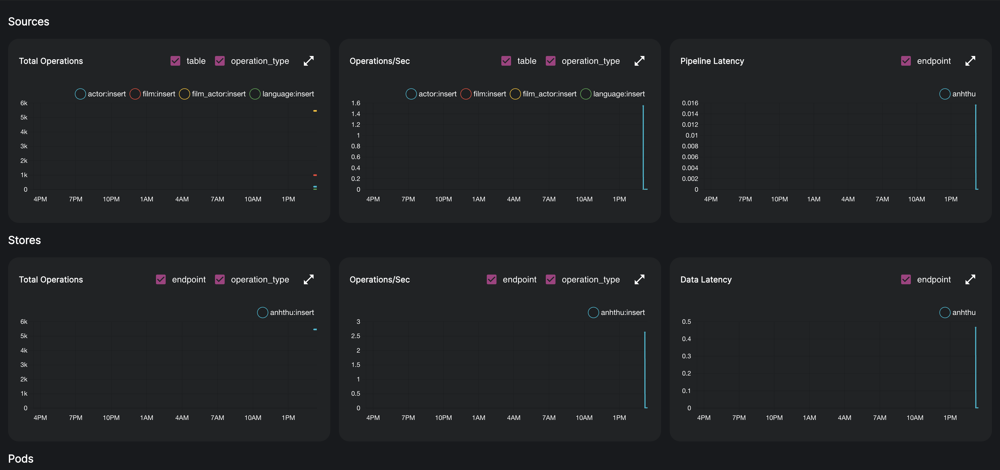
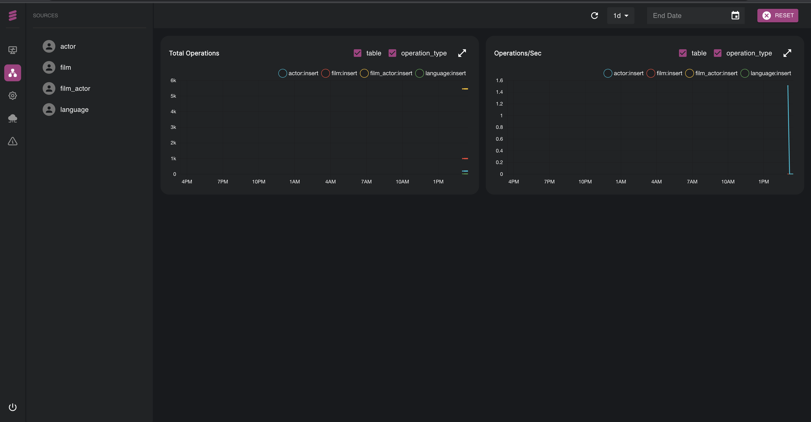
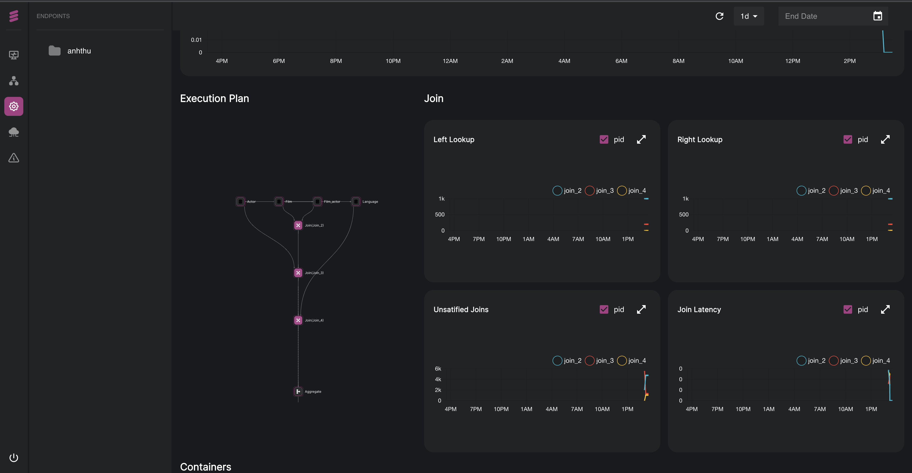
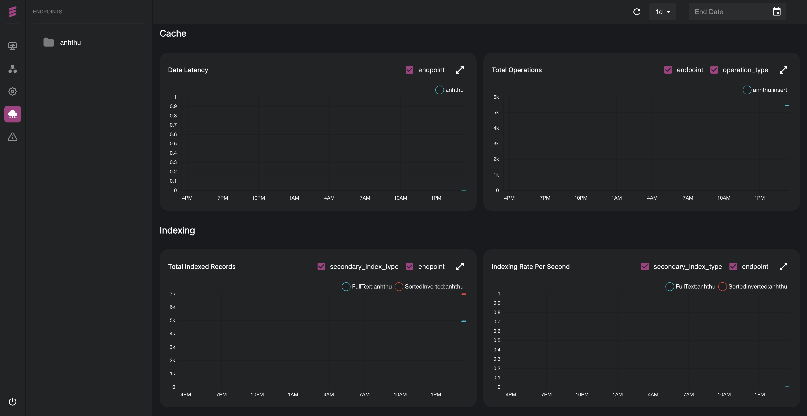

# Monitoring your Application

Dozer UI provides its own dashboard to monitor the Application. It consists in different charts which show different parameters of your application.  On the menu, on the left side of the dashboard, you can find different tabs. Let's take a look at each of them.

## 📊 Overview

The very first dashboard is an overview of many important settings of your application. 
This dashboard shows graphical representations of Sources, Stores, Sessions, Cache, and Pods.

 
Notice that you can specify the date on which you will monitor the application, for example, monitor all the operations you did last 1 day.

## Sources
The second tab of the menu will show you a dashboard of data sources in your application. It will show a chart of Total Operations and another chart of Operations/Second.

For each chart, you can select the table and the operation type you want to monitor.

## Pipelines
The third tab of the menu consists in monitoring the pipelines of your application.

Here, you will have a detailed Execution Plan for each operation, for example of JOIN operations performed in the data source.

## Endpoints
The fourth tab consists in monitoring the endpoints of your application. For each graph, you can select to show the endpoint.

You will have detailed information about Data Latency and Detailed Operations of the Cache. Also, you will have Total Indexed Records, and Indexing Rate per Second, in the Indexing graphs.

## Errors

In the last tab of the menu, you will have a detailed information about all errors which might encounter in the application. 

