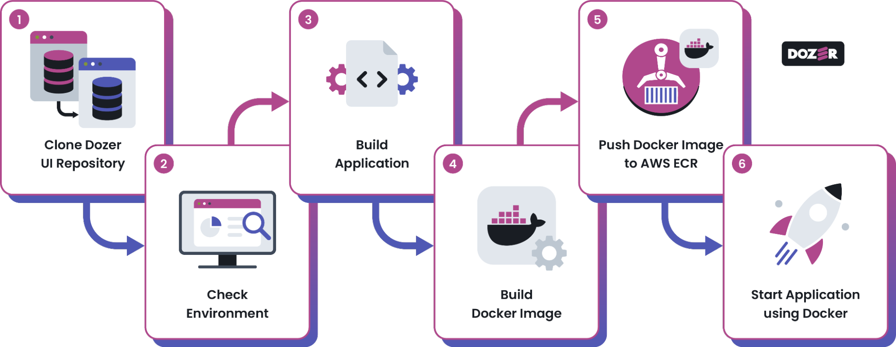
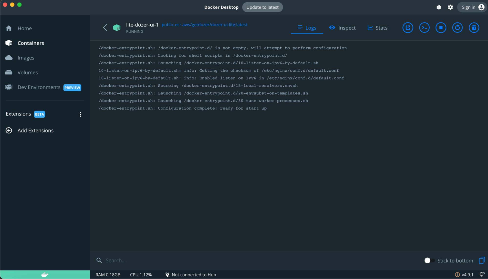
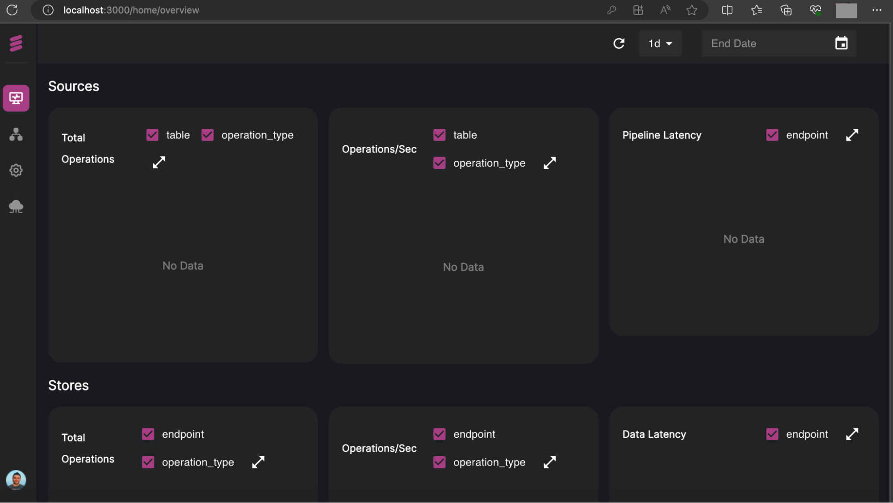

# Monitoring your Application

This guide provides step-by-step instructions on building and running the `dozer-ui` in a Docker container.

## Prerequisites
Before building the Dozer UI application, ensure that you have done the following:
- Install __Docker__
- Install __NPM__ or __Yarn__
- __AWS ECR__ Account
- Install __AWS CLI__

## Steps


### Step 1: Clone Dozer UI Repository
Clone the dozer-ui repository [here](https://github.com/getdozer/dozer-ui).
> Note: Ensure that you have access to the repository.

### Step 2: Check Environment
Before you begin, ensure you have the `.env.lite` file in your project directory.
```bash
cp .env.lite .env
```

### Step 3: Build the Application
Build the application by running the following command:
```bash
#yarn
 yarn build

#or npm
 npm run build
```

### Step 4: Build Docker Image
Once the application building is complete, you can now build your Docker image by running the following command:
```bash
docker build . -t dozer-ui-lite
```

### Step 5: Push Docker Image to AWS ECR
  1. Tag the Docker image before pushing it to AWS ECR by running the following command:
  ```bash
  docker tag dozer-ui-lite:latest public.ecr.aws/getdozer/dozer-ui-lite:latest
  ```
  2. Now, push the tagged Docker image to __AWS Elastic Container Registry (ECR)__ by running the following command:
  ```bash
  docker push public.ecr.aws/getdozer/dozer-ui-lite:latest
  ```
### Step 6: Start Application using Docker
Finally, start the Docker image application that  you have  just created by running the following command:
```bash
docker run -p 3000:8080 dozer-ui-lite
```


Your Dozer application should now be accessible at `http://localhost:3000/`. And you can Register an account using your email address and your password. After register you should go to this page http://localhost:3000/home/overview/




