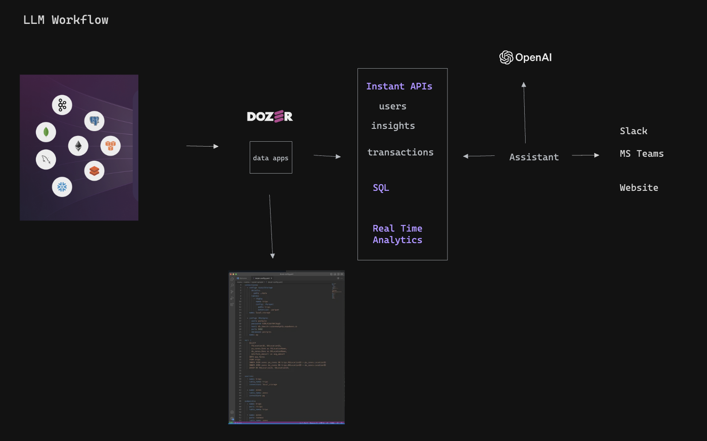

# Build your GPT assistant powered with real-time data using Dozer

## Data Dilemma
(LLM) assistants is reshaping the business world which have the potential to personalize customer experiences in unprecedented ways. Companies will have to find ways to rapidly unlock the data in silos and feed the LLMs turning information into a competitive edge. 

## Solution

Dozer offers effortless data integration bringing real-time data from different data sources. By transforming data in-flight and providing low latency APIs, Dozer ensures that the LLMs are constantly updated with the latest inputs, enabling every interaction with their digital assistants both current and contextually aware.

 

  

# Benefits

 

## Seamless Data Integration

Dozer connects disparate data sources, creating a cohesive data ecosystem. This unified approach removes barriers, enabling fluid communication between databases and your LLM assistants.

  

## Scalable Infrastructure

As your data grows, so does Dozer. Our scalable solutions grow with your business, ensuring that your LLM assistants can handle increasing volumes and complexities of data with ease.

## Real-Time Data Processing

With Dozer, your data isn't just current; it's up-to-the-second. Real-time processing ensures that your LLM assistants are working with the most recent and relevant information available.

  

## Cost-Effective

Reduce the need for extensive in-house data engineering teams. Dozer's streamlined platform is designed to be cost-effective, minimizing overhead while maximizing your digital assistant's capabilities.

## Enhanced Personalization

Unlock the potential of personalized customer experiences with LLM assistants that adapt to each interaction. Dozer lets you build hyper specific experiences with your own data. 

  

## Quick Deployment

Turn the weeks or months of development time into days. Dozer's efficient framework and intuitive interface mean that you can deploy your LLM assistant rapidly, staying ahead of the market curve.

  

# Related Articles

- ### [GPTs And Assistants](https://getdozer.io/blog/articles/gpts-and-assistants/)

    Explore the latest advancements from OpenAI, delving into the world of GPTs and Assistant APIs, and discover their profound implications for the future of artificial intelligence.

- ### [How To Use Assistant APIs? ](https://getdozer.io/blog/articles/how-to-use-assistant-apis/)

    Effortlessly create and deploy your personalized assistant with powerful retrieval capabilities using OpenAI's Assistant APIs. Learn more about this streamlined process. 
    

