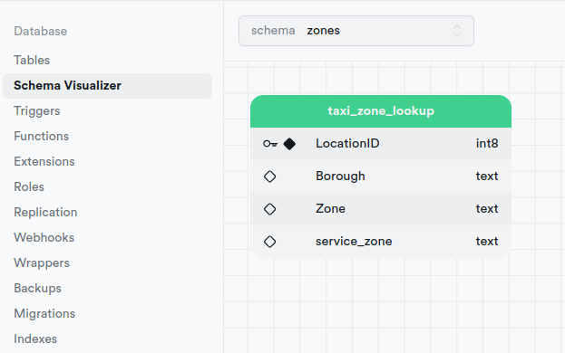

# Unlock the Power of using Dozer with new schemas in PostgreSQL

Welcome to this guide and explore the potential of using Dozer with new schemas in PostgreSQL. We will delve into the key features and benefits of this tool, shedding light on how it can help transform your databases into high-performing assets. Let's get data from a schema different from `public` schema in PostgreSQL.
Whether you are a small business or a large enterprise, unlocking the power of Dozer can give you a competitive edge in today's fast-paced digital landscape. So, let's dive in and explore various Dozer data transformations.

## What is Dozer?
Dozer is a powerful open-source data API backend that simplifies the process of ingesting real-time data from various sources and serving it through REST and gRPC endpoints. It supports a wide range of data sources. In this guide we will focus on data sources in PostreSQL.

## Prerequisites
Before we begin, make sure you have already installed:

* Dozer. For more installation instructions, visit [the Dozer documentation](https://getdozer.io/docs/dozer).
* PostgreSQL and connect it with Dozer. For more information, you can read the [Dozer PostgreSQL connector overview](https://getdozer.io/docs/sources/postgres). 
* Supabase which is an open-source tool to start a project with a Postgres database. For more information, visit the [Supabase website](htpps://www.supabase.com).

## Contents
The guide is broadly divided into 5 sections, with each section describing how to use a particular function or clause.
1. Downloading and understanding the dataset
2. Starting a project in PostgreSQL
3. Configure the Dozer connector PostgreSQL
4. Filtering Data
5. Running Dozer Live

## Downloading and understanding the dataset
We will create a new schema in PostgreSQL named zones and a table taxi_zone_lookup. The primary key in taxi_zone_lookup is the field LocationID.


## Starting a project in PostgreSQL
 For simplicity, we will use supabase, a fully managed PostgreSQL database service. Head over to [Supabase](htpps://www.supabase.com) and **create a new project**.
Once created, head over to your project settings in Supabase, click on **Database**, and take note of the **Connection Info** details. We will use these details later on in the configurations.

Now, let's **create a schema**. In the SQL Editor, type the following SQL Query. 

``` SQL
-- Create a new schema

CREATE SCHEMA zones;
```

Next, run this query. You have already a new schema created. 
Now let's create a new table named `zones`. In the Table Editor, select the schema `zones`, select New Table, name it `taxi_zone_lookup`, and import the data from [this CSV file](https://d37ci6vzurychx.cloudfront.net/misc/taxi+_zone_lookup.csv). 
To import data, click on the button **Import data via spreadsheet** when creating a  new table in Supabase. Upload the CSV file and select `LocationID` as the primary key.

In the Schema Visualizer, select zones, and see the schema visualizer of the table taxi_zone_lookup.



## Configure the Dozer connector PostgreSQL
At this point, you should initialize a Dozer application, and edit the connection in the `dozer_config.yaml` file. 

``` yaml
connections:
- config: !Postgres
    user: ** Your Supabase user ** (generally postgres)
    password: ** Your Supabase password **
    host: ** Your Supabase host **
    port: ** Your Supabase port ** (generally 5432)
    database: postgres
    schema: zones
  name: pg
```
In the configuration, you should use the Connection Info details, as mentioned above, for the host config. 

## Filtering Data
Let us write a query to select data with a where condition. For example, where `Borough` is `Manhattan`. For this, we can use the WHERE clause.

```SQL
sql: |

  -- Query that calculates the displays Manhattan Zone
  
  SELECT *
  INTO table1
  FROM taxi_zone_lookup
  WHERE "Borough" LIKE 'Manhattan';
```

Now, set the sources and endpoints, in the `dozer_config.yaml` file, similar to this example:

```yaml
sources:
  - name: taxi_zone_lookup
    table_name: zones.taxi_zone_lookup
    connection: pg

endpoints:
  - name: manhattan
    path: /manhattan
    table_name: table1
```
Notice the settings of the source and the table name, referencing to new schema.
After we have set up the connection, let's go Live in Dozer.

## Running Dozer Live

At this point, let's run Dozer live, with the command: `dozer live`

[](./blog_postgreSQL_Live.png)

In the Execution Tab, we can see live results of the connection. In the API Endpoints Tab, we can make live queries from the filtered data. 
## Conclusion
As you can see, Dozer offers possibilities to connect to different schemas in PostgreSQL, not only the default public schema. This makes Dozer a powerful tool for quickly building data products and monitoring them live.
For more information and examples, check out the Dozer GitHub repository and dozer-samples repository. 
Happy coding, Happy Data APIng! 🚀👩‍💻👨‍💻
